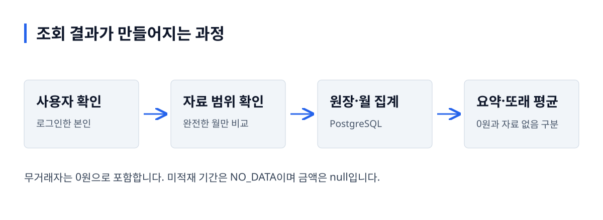

# FinMate API

**같은 소득대의 소비를 비교할 때, 평균의 분모부터 맞춥니다.**

가가제작소 팀 프로젝트의 금융 조회 API입니다. 이번 개인 보강은 합성 원장의 자료 범위·무거래자·재집계 정확성과 실제 화면 연결을 다룹니다. Java 21, Spring Boot, Spring MVC, JPA와 PostgreSQL을 사용합니다.

[핵심 판단](#핵심-판단) · [검증 결과](#검증-결과) · [로컬 실행](#로컬-실행) · [코드 읽기](#코드-읽기)

## 실제 화면


이 API를 호출하는 FinMate 앱의 실제 로컬 화면입니다. 가상 인물 24명·거래 1,344행을 사용하며 실제 은행 정보가 아닙니다.

<details>
<summary>모바일 화면</summary>


</details>

## 사용 흐름과 처리 구조

데모 시작 → 기간 선택 → 거래·요약 조회 → 같은 소득대의 월평균 비교



그림 설명: 사용자 확인 → 자료 범위 확인 → 원장·월 집계 → 요약·또래 평균. 무거래자는 0원으로 포함합니다. 미적재 기간은 NO_DATA이며 금액은 null입니다.

## 핵심 판단

| 문제 | 선택 | 확인한 근거 |
|---|---|---|
| 인원수와 평균의 분모가 달랐습니다. | 해당 월 전체 자료가 있는 같은 소득대의 사람을 본인 포함 비교하고 무거래자는 0원으로 계산합니다. | [정확성 통합 테스트](src/test/java/com/gagastudio/finmate/metrics/PeerAccuracyIntegrationTest.java) |
| 마지막 거래 삭제 후 이전 집계가 남았습니다. | 전체 집계를 삭제·재생성하는 작업을 하나의 트랜잭션으로 묶었습니다. | [MonthlyRollup](src/main/java/com/gagastudio/finmate/metrics/MonthlyRollup.java) |
| 대안별 백분위 계산 방식이 달랐습니다. | 결과 일치를 먼저 검사하고, 모든 원표본을 정렬해 같은 방식으로 계산합니다. | [측정 코드](src/test/java/com/gagastudio/finmate/metrics/PeerCompareQueryPlan.java), [원표본](docs/evidence/2026-10-02/peer-comparison/samples.csv) |

## 검증 결과

2026-10-02 로컬 검증: 백엔드 **56개 통과**, 명시적으로 실행해야 하는 대규모·외부 이미지 시험 **4개 제외**. 별도 SQL 비교 실험 1개와 앱 데스크톱·모바일 E2E 4개를 통과했습니다. 핵심 테스트는 개인 데이터 폴더 없이 실행됩니다.

SQL 대안 비교는 합성 원장 432,000행, 워밍업 5회·대안별 40회입니다. JDBC 왕복 시간의 p50은 기존 쿼리 68.343ms, 재작성 37.004ms, 사전 집계 3.532ms, 재작성+커버링 인덱스 9.818ms였습니다. **같은 조건의 대안 비교**이며 HTTP 응답시간이나 운영 성과가 아닙니다. 집계 갱신 비용과 용량도 함께 기록했습니다.

[검증 기록](docs/VERIFICATION.md) · [측정 조건·p95·실행 계획·한계](docs/PERF_RESULT.md)

## 로컬 실행

```bash
# Docker 실행 필요
docker compose -p finmate-rebuild -f compose.demo.yml up -d --build
curl http://localhost:18081/actuator/health
```

API는 `http://localhost:18081`입니다. 첫 시작에 저장소의 합성 데이터를 적재합니다. [FinMate 앱](https://github.com/gaga-studio/finmate-app)에서 `npm ci` 후 `npm run dev -- --host 127.0.0.1 --port 5175`를 실행합니다.

```bash
# Java 21·Docker 필요
./gradlew test
# 선택 실행: 동일한 결과가 나오는지 검증한 뒤 SQL 측정
FINMATE_BENCHMARK=1 ./gradlew test --tests '*PeerCompareQueryPlan'
```

종료할 때는 같은 Compose 명령의 `up -d --build`를 `stop`으로 바꾸면 DB 볼륨을 보존합니다. 로컬 Compose의 계정·서명 키는 공개 배포에 사용하지 않습니다.

## 범위와 한계

개인 요약은 기준일까지의 일·주·월, 또래 비교는 해당 월 전체를 사용합니다. 실제 은행 연동·운영 부하·실사용자 검증은 하지 않았습니다. 그림일기·미션·추천은 보존한 팀 시연이며 대표 조회 흐름의 완성 범위에 포함하지 않습니다.

이번 개인 보강은 AI 지원으로 구현하고 로컬에서 검증했습니다. 코드로 확인한 동작·실험 관측·미검증 범위를 구분하며, 실제로 겪지 않은 운영 장애나 팀 전체 결과를 개인 성과로 표현하지 않습니다.

## 코드 읽기

[MeController](src/main/java/com/gagastudio/finmate/api/MeController.java) → [OverviewService](src/main/java/com/gagastudio/finmate/metrics/OverviewService.java) / [TransactionService](src/main/java/com/gagastudio/finmate/ledger/TransactionService.java) → [PeerCompareService](src/main/java/com/gagastudio/finmate/metrics/PeerCompareService.java). [선택 이유·작은 변경 과제](docs/SERVICE_GUIDE.md)와 함께 읽습니다.

[FinMate 앱](https://github.com/gaga-studio/finmate-app) · [기존 합성 데이터 생성 프로젝트](https://github.com/gaga-studio/finmate-data)
