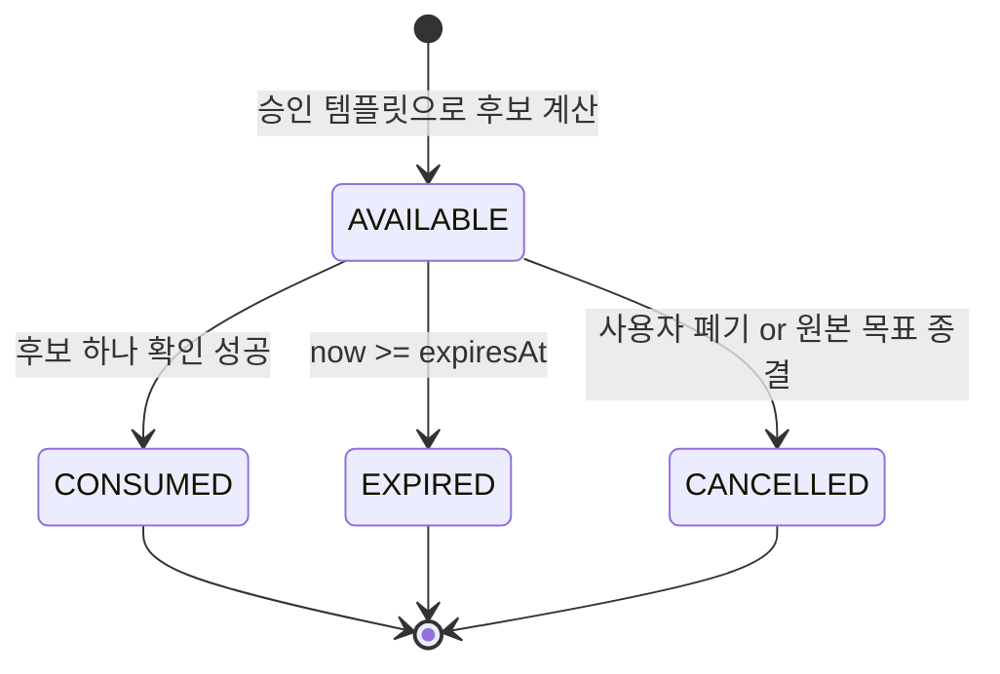
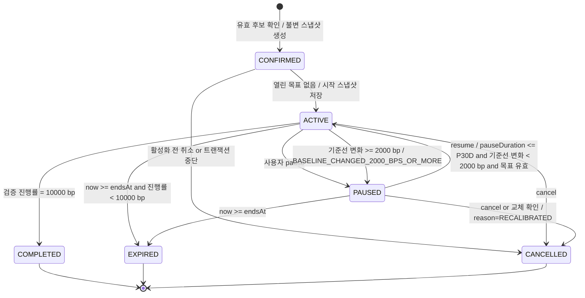
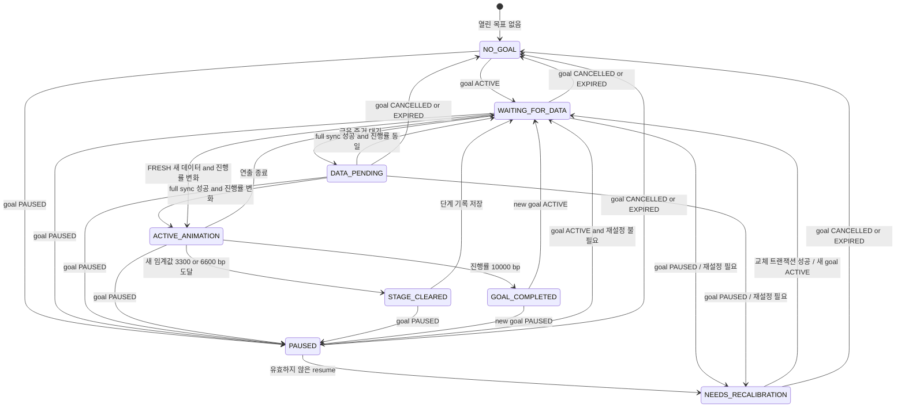
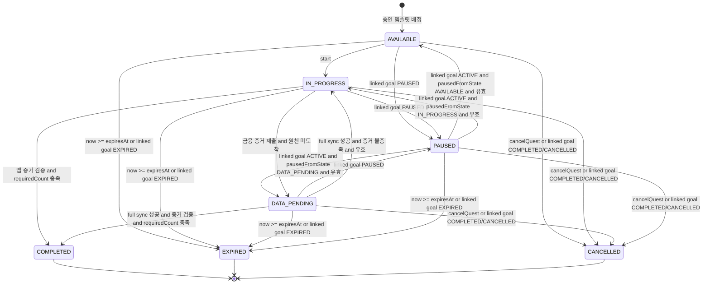
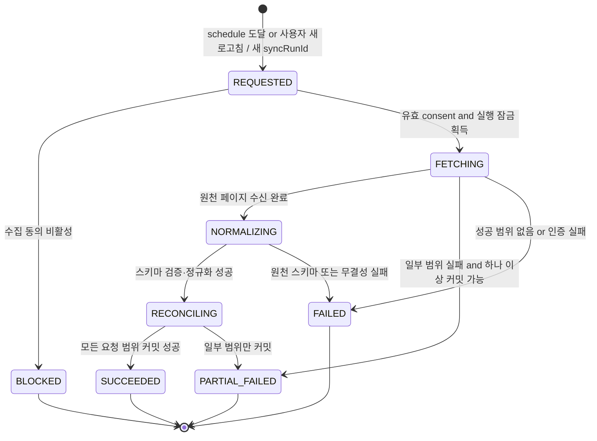
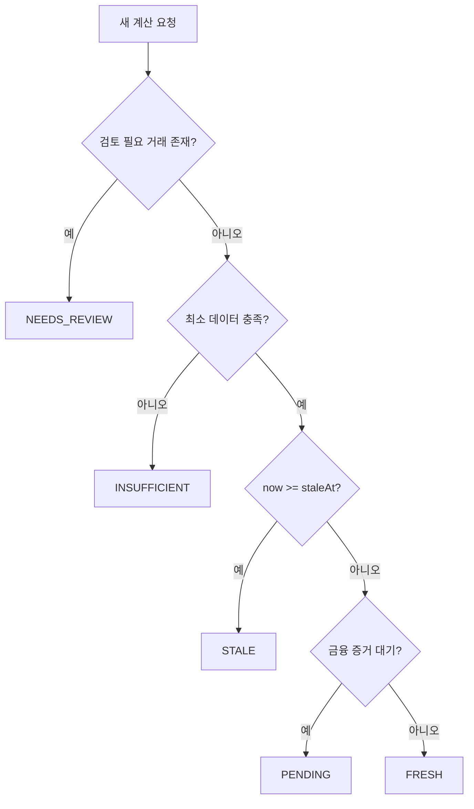
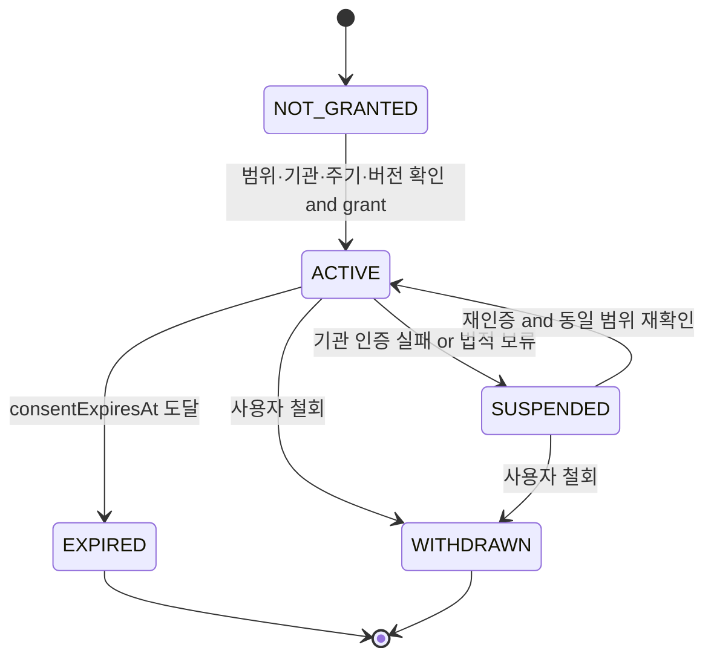
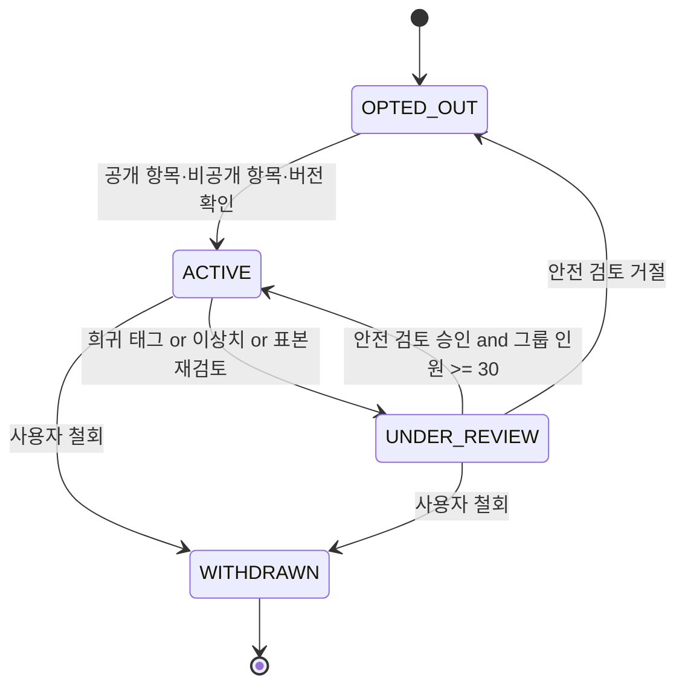

# FinMate vNext 상태 머신

## 1. 공통 규칙

- 상태 변경 명령은 `idempotencyKey`를 요구한다. 같은 키와 같은 본문은 최초 결과를 반환하고, 같은 키와 다른 본문은 `IDEMPOTENCY_CONFLICT`로 거절한다.
- 모든 상태 이벤트는 `occurredAt`을 UTC 오프셋 포함 ISO 8601로 기록한다.
- 금융 데이터에 의존한 전이는 `calculationVersion`, `dataState`, `lastSyncedAt`, `sourceDataVersion`을 기록한다.
- 서버만 상태를 확정한다. 클라이언트와 AI는 상태를 직접 쓰지 않는다.
- 종결 상태에서 같은 종결 명령을 다시 받으면 현재 상태를 반환한다. 다른 상태로의 전이는 거절한다.
- 후보는 `GoalCandidateSet`에 속하고 목표는 `UserGoal`에 속한다. 두 애그리거트의 상태를 섞지 않는다.

다음 registry가 도메인, 합성 시나리오, API conventions, OpenAPI의 정본 코드 집합이다.

```json contract-codes
{
  "errorCodes": [
    "ACTIVE_GOAL_EXISTS",
    "AUTH_REQUIRED",
    "AUTH_TOKEN_INVALID",
    "BUSINESS_RULE_VIOLATION",
    "CANDIDATE_EXPIRED",
    "CONSENT_REQUIRED",
    "DATA_INSUFFICIENT",
    "DATA_STALE",
    "DEPENDENCY_UNAVAILABLE",
    "FORBIDDEN",
    "IDEMPOTENCY_CONFLICT",
    "INTERNAL_ERROR",
    "INVALID_CURSOR",
    "MALFORMED_REQUEST",
    "NUMERIC_OVERFLOW",
    "PRECONDITION_FAILED",
    "RATE_LIMITED",
    "RECALIBRATION_REQUIRED",
    "RESOURCE_NOT_FOUND",
    "VALIDATION_FAILED"
  ],
  "idempotencyConflictCode": "IDEMPOTENCY_CONFLICT",
  "recalibrationConflictCode": "RECALIBRATION_REQUIRED",
  "recalibrationReasons": [
    "BASELINE_CHANGED_2000_BPS_OR_MORE",
    "TEMPLATE_INACTIVE",
    "REQUIRED_CONSENT_CHANGED",
    "PAUSE_EXCEEDED_P30D"
  ]
}
```

## 2. 목표 후보와 사용자 목표

### 2.1 목표 후보 세트

신규 목표 후보와 재설정 후보는 같은 후보 규칙을 사용하지만 재설정 후보에는 `replacesGoalId`가 필수다.



후보 생성은 `UserGoal`의 상태, 기준선 스냅샷, 목표값을 변경하지 않는다. `AVAILABLE` 후보만 확인할 수 있고 확인 직전에 만료, 동의, 데이터 신선도, 템플릿 활성 여부를 다시 검증한다.

### 2.2 `UserGoal` 상태 머신

정본 상태 집합은 `CONFIRMED | ACTIVE | PAUSED | COMPLETED | EXPIRED | CANCELLED`다. `CANDIDATE`와 `RECALIBRATION_REQUIRED`는 `UserGoal.state`가 아니다.

품질 fixture와 UI가 쓰는 `active_goal_state = RECALIBRATION_REQUIRED`는 persisted state가 아니라 `recalibration.effectiveState` projection을 뜻한다. 이때 저장된 `UserGoal.state`는 반드시 `PAUSED`다.



| 상태 | 진입 조건 | 허용 작업 | 진행률 갱신 |
| --- | --- | --- | --- |
| `CONFIRMED` | 유효 후보·동의·멱등성 검증 성공 | 원자적 활성화, 취소 | 금지 |
| `ACTIVE` | 사용자당 열린 목표 하나 | 일시정지, 취소, 데이터 기반 갱신 | `dataState = FRESH`일 때만 허용 |
| `PAUSED` | 사용자 명령 또는 재설정 필요 | 유효성 재검증, 교체 후보 생성·확인, 취소 | 금지 |
| `COMPLETED` | 검증된 현재 진행률 `10000 bp` | 조회 | 금지 |
| `EXPIRED` | 종료 시각 도달, 미완료 | 조회 | 금지 |
| `CANCELLED` | 사용자 취소 또는 교체 완료 | 조회 | 금지 |

### 2.3 전이 가드와 재설정

1. 신규 후보 확인 시 `now < expiresAt`, 템플릿이 활성이고 필요한 동의 버전과 연결이 유효해야 한다. 기준선을 쓰는 후보의 기준선 해시는 최신 기준선 해시와 같아야 하며 증가형·범위 유지형 정량 목표는 `FRESH`만 허용한다.
2. 사용자당 `CONFIRMED | ACTIVE | PAUSED` 목표는 합쳐서 최대 하나다. 일반 신규 후보로 열린 목표를 덮어쓰지 않는다.
3. 일시정지 기간은 `[pausedAt, resumeRequestedAt)`의 실제 경과 duration이다. 정확히 `P30D`이고 기준선 변화가 `2000 bp` 미만이면 기존 목표를 재개할 수 있다.
4. `pauseDuration > P30D`, 소득·필수지출 변화 `>= 2000 bp`, 템플릿 비활성, 필수 동의 변경 중 하나라도 있으면 목표는 `PAUSED`를 유지하고 `recalibrationRequired = true`로 기록한다. 재개 요청은 `RECALIBRATION_REQUIRED` 충돌을 반환한다.
5. 재설정 후보 생성은 별도 `GoalCandidateSet(replacesGoalId)`만 만든다. 기존 목표는 후보 상태로 전이하지 않는다.
6. 교체 후보 확인은 한 데이터베이스 트랜잭션에서 후보를 `CONSUMED`, 기존 목표를 `CANCELLED / RECALIBRATED`, 새 목표를 `CONFIRMED -> ACTIVE`로 만든다. 응답은 기존 연결 퀘스트 각각의 terminal 상태·사유·시각과 새로 생성한 퀘스트 ID를 분리해 노출하며 두 ID 집합은 서로소다. 이 종결·생성도 같은 트랜잭션에 포함한다.
7. 교체 확인 검증이나 커밋이 실패하면 기존 목표는 `PAUSED`, 교체 후보는 `AVAILABLE`로 남는다. 부분 교체는 허용하지 않는다.
8. `PAUSED` 중 `endsAt`에 도달하면 교체 확인보다 `EXPIRED`가 우선하며 후보 세트도 `CANCELLED`가 된다.

`cancellationReason`은 `NO_LONGER_RELEVANT | TOO_DIFFICULT | DATA_ISSUE | RECALIBRATED | OTHER`다. `RECALIBRATED`는 교체 확인 트랜잭션만 쓸 수 있다.

`recalibrationReason`은 정확히 다음 네 값이다.

| 감지 조건 | `recalibrationReason` |
| --- | --- |
| 소득 또는 필수지출 기준선 변화 `>= 2000 bp` | `BASELINE_CHANGED_2000_BPS_OR_MORE` |
| 목표 템플릿 비활성 | `TEMPLATE_INACTIVE` |
| 목표에 필요한 동의 버전·범위 변경 | `REQUIRED_CONSENT_CHANGED` |
| 실제 일시정지 기간 `> P30D` | `PAUSE_EXCEEDED_P30D` |

## 3. 레이드 상태 머신

레이드는 목표의 읽기 모델이다. 아래 우선순위 투영표가 모든 목표 종결·일시정지·데이터 상태를 닫으며, 애니메이션 상태는 그 위의 일시적 표시다.

| 조건 | 정본 `raidState` |
| --- | --- |
| 목표 없음 또는 목표 `CANCELLED | EXPIRED` | `NO_GOAL` |
| 목표 `COMPLETED` | `GOAL_COMPLETED` |
| 목표 `PAUSED`이고 `recalibrationRequired = true` | `NEEDS_RECALIBRATION` |
| 목표 `PAUSED` | `PAUSED` |
| 목표 `ACTIVE`이고 금융 증거 대기 | `DATA_PENDING` |
| 목표 `ACTIVE`이고 새 진행률 없음 또는 계산 차단 | `WAITING_FOR_DATA` |
| 목표 `ACTIVE`이고 새 진행률 있음 | `ACTIVE_ANIMATION`, 필요 시 `STAGE_CLEARED` |



우선순위는 `GOAL_COMPLETED > NEEDS_RECALIBRATION > PAUSED > DATA_PENDING > ACTIVE_ANIMATION > STAGE_CLEARED > WAITING_FOR_DATA > NO_GOAL`이다.

- 완료 리포트 조회는 상태 전이를 일으키지 않는다. 완료 목표의 raid projection은 새 목표가 활성화될 때까지 `GOAL_COMPLETED`이고, 별도 archival semantics가 정의되기 전에는 조회 명령으로 `NO_GOAL`이 되지 않는다.
- `ACTIVE_ANIMATION`은 최대 한 번의 연출 후 대기로 간다.
- `STAGE_CLEARED`는 `3300 bp` 또는 `6600 bp`를 처음 넘은 경우에만 발생한다. 이미 해금한 단계는 다시 잠그지 않는다.
- 현재 진행률이 내려가도 `highestProgressBps`와 `unlockedStage`는 유지한다. 하락을 보스 회복으로 표현하지 않는다.
- `dataState = STALE | INSUFFICIENT | NEEDS_REVIEW`이면 기존 숫자를 유지하고 계산 중지 이유를 표시한다.

## 4. 퀘스트 상태 머신

정본 상태 집합은 `AVAILABLE | IN_PROGRESS | DATA_PENDING | PAUSED | COMPLETED | EXPIRED | CANCELLED`다.



| 전이 | 부수 효과 |
| --- | --- |
| `AVAILABLE -> IN_PROGRESS` | `startedAt` 저장, XP 없음 |
| `IN_PROGRESS -> DATA_PENDING` | `dataState = PENDING`, 이전 금융 스탯·진행률 유지 |
| `* -> PAUSED` | `pausedFromState` 저장, 증거 접수·완료·XP 발행 차단 |
| `PAUSED -> *` | 목표와 퀘스트가 모두 유효한 경우에만 저장한 상태로 복귀 |
| `* -> COMPLETED` | 증거별 멱등성 검사 후 허용된 XP 이벤트 1회 기록 |
| `* -> EXPIRED | CANCELLED` | XP 차감·스트릭 손실·보스 변화 없음 |

`goalId`가 있는 퀘스트에만 목표 상태를 전파한다. `goalId = null`인 일반 학습 퀘스트는 목표의 일시정지·재개·종결과 무관하게 자체 만료와 검증 규칙을 따른다. 투자 판단 퀘스트는 완료돼도 `xpAwarded = 0`이고 배지·축하 효과가 없다.

공개 OpenAPI의 `cancelQuest` 명령은 사용자가 소유한 `AVAILABLE | IN_PROGRESS | DATA_PENDING | PAUSED` 퀘스트를 `CANCELLED`로 전이하는 유일한 사용자 취소 계약이다. 명령은 `If-Match`, 멱등성 키와 `NO_LONGER_RELEVANT | TOO_DIFFICULT | OTHER` 사유를 요구하고 stale version은 `412 PRECONDITION_FAILED`로 거절한다. 같은 멱등성 키 재전송은 최초 terminal 결과를 반환하고, 취소는 XP 차감·신규 XP·금융 스탯·목표 진행률·레이드 변화를 만들지 않는다. `COMPLETED | EXPIRED | CANCELLED`에서는 다른 상태로 돌아가지 않는다.

완료 판정은 `QuestEvidence.verificationSource`에 실제 사용한 `VerificationSource` enum 값을 저장한 증거만 집계한다. 템플릿이 허용한 source라는 사실만 저장하거나 앱·MyData 같은 넓은 유형으로 축약하지 않는다. 각 증거는 `sourceReferenceHash`, `evidenceType`, 검증 상태, 원천 발생 시각, 검증 시각을 함께 보존한다.

## 5. 동기화 실행 상태 머신

`syncStatus`는 수집 파이프라인의 실행별 기술 상태이고 `dataState`는 계산 가능 상태다. 영속 `SyncJob`/`SyncRun` 한 건의 정본 상태 집합은 `REQUESTED | FETCHING | NORMALIZING | RECONCILING | SUCCEEDED | PARTIAL_FAILED | FAILED | BLOCKED`다. `SUCCEEDED | PARTIAL_FAILED | FAILED | BLOCKED`는 terminal이며 한 번 진입한 실행은 다른 상태로 전이하지 않는다.

`IDLE`은 실행 row의 상태가 아니다. 활성 동의가 있고 실행 잠금이 없으며 다음 schedule 또는 사용자 요청을 기다리는 **scheduler/connection readiness projection**에서만 사용할 수 있다. readiness가 `IDLE`이어도 과거 실행의 `syncStatus`는 terminal 값 그대로 조회된다.



### 5.1 실행과 신선도 규칙

- 실행 잠금 키는 `(userId, consentId)`이며 동시에 하나만 `FETCHING..RECONCILING` 구간에 존재한다.
- 공급자 페이지는 `providerId + consentId + cursor`로 멱등 저장한다.
- 모든 요청 범위가 커밋된 `SUCCEEDED`에서만 공개 `lastSyncedAt = min(committed providerDataAsOf)`를 전진시킨다. 서버 수신 시각으로 대체하지 않는다.
- `PARTIAL_FAILED`에서 성공 범위를 커밋하면 내부 `lastPartialSyncedAt`을 전진시킬 수 있지만 공개 `lastSyncedAt`은 이전 완전 성공 값으로 유지한다. 성공 범위로 새 `sourceDataVersion`을 만들 수 있어도 이를 완전 동기화로 표시하지 않는다.
- 필요한 계좌나 범위가 실패하면 `dataState = STALE | INSUFFICIENT`로 판정하고 진행률·퀘스트 금융 증거를 갱신하지 않는다.
- terminal 실행의 `syncStatus`, `finishedAt`, 범위 결과는 불변이다. `PARTIAL_FAILED | FAILED`의 재시도는 backoff 뒤 새 `syncRunId`, `syncStatus = REQUESTED`, `retryOfSyncRunId`로 별도 실행을 만든다. 이전 실행을 `REQUESTED`로 되돌리거나 `IDLE`로 덮어쓰지 않는다.
- 재시도 간격은 `PT5M`, `PT30M`, `PT2H` 순서이며 세 번 실패하면 다음 동의 전송 주기까지 자동 재시도를 멈춘다.

### 5.2 동기화 결과에서 `dataState` 파생



## 6. 마이데이터 수집 동의 상태 머신

동의 종결 상태는 모든 문서와 API에서 `WITHDRAWN`이다.



- `WITHDRAWN`은 같은 `consentId`에서 되돌릴 수 없는 terminal state다. 재동의는 새 `consentId`와 현재 약관 버전으로 별도 애그리거트를 만든다.
- `WITHDRAWN` 즉시 새 수집을 차단하고 실행 중 요청의 커밋을 폐기한다.
- 철회 전 개인 기록은 보존 정책에 따라 유지하되 새 원천 수집과 목표 진행 갱신은 중단한다.

## 7. 익명 카드 공개 동의 상태 머신

수집 동의와 공개 동의는 별도 애그리거트며 종결 상태 이름은 똑같이 `WITHDRAWN`이다.



- `ACTIVE`이면서 `safetyStatus = APPROVED`인 개인 카드만 추천 인덱스에 들어간다. 그룹 카드는 개인 동의 레코드를 응답에 연결하지 않는다.
- `WITHDRAWN` 이벤트 수신 즉시 신규 조회에서 제외하고 캐시·파생 인덱스는 `P1D` 안에 제거한다.
- 타인이 이미 확정한 목표에서는 `sourceProfileKey` 연결을 삭제하고 `goalTemplateId`, `routineType`만 남긴다.
- 재공개는 기존 `shareConsentId`를 되살리지 않고 새 ID와 버전으로 안전 검토를 다시 수행한다.

## 8. 상태 이벤트 최소 스키마

```json
{
  "eventId": "evt_01J2ABCDEF0123456789XYZ",
  "aggregateType": "USER_GOAL",
  "aggregateId": "goal_01J2ABCDEF0123456789XYZ",
  "fromState": "PAUSED",
  "toState": "ACTIVE",
  "reasonCode": "RESUME_VALIDATED",
  "occurredAt": "2026-07-12T09:00:00+09:00",
  "idempotencyKey": "01J2ABCDEF0123456789XYZ",
  "calculationVersion": "goal-calc-1.0.0",
  "dataState": "FRESH",
  "lastSyncedAt": "2026-07-12T08:55:00+09:00",
  "sourceDataVersion": "sdv_20260712_085500_7f3a"
}
```
