# FinMate vNext ERD와 데이터 사전

## 1. 저장 원칙

- 공개 리소스 기본 키는 OpenAPI와 같은 `UUID`다. 내부 outbox 이벤트는 시간 정렬 가능한 ULID 문자열을 사용할 수 있으나 공개 리소스 ID와 섞지 않는다.
- 금액 입력과 저장은 signed `BIGINT`, `currency = KRW`다. 계산 중간값은 `arbitrary-precision` 정수로 처리하고 저장 직전에 `checked int64` 변환을 수행한다. 부동소수점 금액·비율 컬럼, 포화, wraparound는 금지한다.
- 비율은 `INTEGER` basis point로 저장한다. 진행률과 금융 스탯은 `0..10000` 제약을 둔다.
- 모든 시각은 `TIMESTAMPTZ`로 저장하고 API에서는 UTC 오프셋 포함 ISO 8601로 직렬화한다. 달력 날짜와 ISO 8601 duration은 각각 `DATE`, `VARCHAR`로 구분한다.
- 공급자 원천과 사용자 수정은 덮어쓰지 않는다. 정정 레코드와 새 계산 스냅샷을 append-only로 추가한다.
- canonical source row는 수집·정규화 계보만 가진다. `calculation_version`, `data_state`, `last_synced_at` 같은 계산·공개 신선도는 계산 스냅샷 또는 API `dataFreshness`와 `SYNC_STATE`에 둔다.
- `source_profile_key`, 공급자 원본 ID, 정확 금융값은 공개 카드·클라이언트 응답·AI 입력에 포함하지 않는다.

## 2. ERD

```mermaid
erDiagram
    USER ||--o{ MYDATA_CONNECTION : owns
    MYDATA_CONNECTION ||--o{ MYDATA_CONSENT : authorizes
    USER ||--o{ SHARE_CONSENT : grants
    MYDATA_CONNECTION ||--|| SYNC_STATE : exposes
    MYDATA_CONNECTION ||--o{ SYNC_RUN : runs
    SYNC_RUN o|--o{ SYNC_RUN : retried_by
    SYNC_RUN ||--o{ SYNC_SCOPE_RESULT : reports
    SYNC_RUN ||--o{ RAW_ASSET_RECORD : receives
    USER ||--o{ FINANCIAL_ACCOUNT : owns
    FINANCIAL_ACCOUNT ||--o{ CANONICAL_TRANSACTION : contains
    FINANCIAL_ACCOUNT ||--o{ BALANCE_SNAPSHOT : has
    SYNC_RUN ||--o{ FINANCIAL_ACCOUNT : sources
    SYNC_RUN ||--o{ CANONICAL_TRANSACTION : sources
    SYNC_RUN ||--o{ BALANCE_SNAPSHOT : sources
    CANONICAL_TRANSACTION ||--o{ CLASSIFICATION_DECISION : classified_by
    USER ||--o{ FINANCIAL_BASELINE : has
    USER ||--o{ ANIMAL_STAT_SNAPSHOT : has
    VALIDATION_GROUP ||--o{ RECOMMENDATION_CARD : validates
    SHARE_CONSENT ||--o{ RECOMMENDATION_CARD : permits_individual
    RECOMMENDATION_CARD ||--o{ VERIFIED_ROUTINE : publishes
    USER ||--o{ GOAL_CANDIDATE_SET : receives
    USER_GOAL o|--o{ GOAL_CANDIDATE_SET : replaced_by
    GOAL_CANDIDATE_SET ||--o{ GOAL_CANDIDATE : contains
    GOAL_TEMPLATE ||--o{ GOAL_CANDIDATE : creates
    FINANCIAL_BASELINE ||--o{ GOAL_CANDIDATE : grounds
    USER ||--o{ USER_GOAL : owns
    GOAL_CANDIDATE ||--o| USER_GOAL : confirms
    USER_GOAL ||--o{ USER_GOAL : replaces
    USER_GOAL ||--o{ GOAL_PROGRESS_SNAPSHOT : records
    USER_GOAL ||--|| RAID_PROGRESS : projects
    USER_GOAL o|--o{ USER_QUEST : links
    USER ||--o{ USER_QUEST : owns
    USER_QUEST ||--o{ QUEST_EVIDENCE : verifies
    USER ||--o{ JOURNEY_RECORD : records
    USER ||--o{ AI_AUDIT_LOG : audits

    USER {
      uuid user_id PK
      string timezone
      string income_regularity
      timestamptz created_at
      timestamptz deleted_at
    }
    MYDATA_CONNECTION {
      uuid connection_id PK
      uuid user_id FK
      string provider_id
      string status
      timestamptz connected_at
      timestamptz withdrawn_at
    }
    MYDATA_CONSENT {
      uuid consent_id PK
      uuid connection_id FK
      string state
      string consent_version
      jsonb scope
      string sync_interval
      timestamptz granted_at
      timestamptz expires_at
      timestamptz withdrawn_at
    }
    SHARE_CONSENT {
      uuid share_consent_id PK
      uuid user_id FK
      string state
      string consent_version
      jsonb public_scope
      timestamptz granted_at
      timestamptz withdrawn_at
    }
    SYNC_STATE {
      uuid connection_id PK
      uuid last_full_sync_run_id FK
      uuid last_partial_sync_run_id FK
      timestamptz last_synced_at
      timestamptz last_partial_synced_at
      timestamptz updated_at
    }
    SYNC_RUN {
      uuid sync_run_id PK
      uuid connection_id FK
      uuid consent_id FK
      uuid user_id FK
      uuid retry_of_sync_run_id FK
      string sync_status
      string source_data_version
      string canonicalization_version
      timestamptz requested_at
      timestamptz started_at
      timestamptz provider_data_as_of
      timestamptz finished_at
    }
    SYNC_SCOPE_RESULT {
      uuid sync_scope_result_id PK
      uuid sync_run_id FK
      string provider_id
      string scope_type
      string scope_key_hash
      string status
      timestamptz provider_data_as_of
      timestamptz committed_at
      string error_code
    }
    RAW_ASSET_RECORD {
      uuid raw_record_id PK
      uuid sync_run_id FK
      string provider_id
      string response_id
      int record_ordinal
      string payload_hash
      timestamptz received_at
      timestamptz purge_at
    }
    FINANCIAL_ACCOUNT {
      uuid account_id PK
      uuid user_id FK
      uuid source_sync_run_id FK
      string provider_id
      string provider_account_id_hash
      string account_type
      string currency
      date opened_on
      date closed_on
      timestamptz provider_created_at
      timestamptz provider_updated_at
      timestamptz provider_data_as_of
      timestamptz source_received_at
      string source_response_id
      int source_record_ordinal
      string source_payload_sha256
      string canonical_record_sha256
      string source_data_version
      string canonicalization_version
    }
    CANONICAL_TRANSACTION {
      uuid transaction_id PK
      uuid user_id FK
      uuid account_id FK
      uuid source_sync_run_id FK
      string provider_id
      string provider_transaction_id_hash
      string deduplication_key UK
      timestamptz booked_at
      string time_precision
      bigint amount_krw
      string currency
      string direction
      string normalized_description
      string merchant_key_hash
      string classification
      int classification_confidence_bps
      uuid linked_transaction_id FK
      jsonb review_reason_codes
      timestamptz provider_created_at
      timestamptz provider_updated_at
      timestamptz provider_data_as_of
      timestamptz source_received_at
      string source_response_id
      int source_record_ordinal
      string source_payload_sha256
      string canonical_record_sha256
      string source_data_version
      string canonicalization_version
    }
    BALANCE_SNAPSHOT {
      uuid balance_id PK
      uuid user_id FK
      uuid account_id FK
      uuid source_sync_run_id FK
      string provider_id
      string provider_balance_id_hash
      bigint balance_krw
      string currency
      string balance_type
      timestamptz as_of
      timestamptz provider_created_at
      timestamptz provider_updated_at
      timestamptz provider_data_as_of
      timestamptz source_received_at
      string source_response_id
      int source_record_ordinal
      string source_payload_sha256
      string canonical_record_sha256
      string source_data_version
      string canonicalization_version
    }
    CLASSIFICATION_DECISION {
      uuid decision_id PK
      uuid transaction_id FK
      string classification
      string actor_type
      string reason_code
      timestamptz decided_at
    }
    FINANCIAL_BASELINE {
      uuid baseline_id PK
      uuid user_id FK
      bigint monthly_income_krw
      bigint essential_expense_krw
      bigint surplus_krw
      string source_data_version
      string calculation_version
      string data_state
      timestamptz last_synced_at
      timestamptz calculated_at
    }
    ANIMAL_STAT_SNAPSHOT {
      uuid stat_snapshot_id PK
      uuid user_id FK
      string animal_code
      string stat_key
      bigint stat_value
      string unit
      string source_data_version
      string calculation_version
      string data_state
      timestamptz last_synced_at
      timestamptz calculated_at
    }
    VALIDATION_GROUP {
      uuid validation_group_id PK
      string cohort_definition_version
      jsonb financial_capacity_constraints
      jsonb generalized_context_tags
      int eligible_profile_count
      jsonb routine_bands
      date validated_on
      string data_state
      timestamptz last_synced_at
    }
    RECOMMENDATION_CARD {
      uuid card_id PK
      string card_kind
      uuid share_consent_id FK
      uuid validation_group_id FK
      string source_profile_key
      string goal_domain
      string safety_status
      date validated_on
      timestamptz removed_at
    }
    VERIFIED_ROUTINE {
      uuid routine_id PK
      uuid card_id FK
      string routine_type
      bigint internal_metric_value
      string metric_unit
      string maintained_for
      timestamptz verified_at
    }
    GOAL_CANDIDATE_SET {
      uuid candidate_set_id PK
      uuid user_id FK
      uuid replaces_goal_id FK
      string state
      timestamptz generated_at
      timestamptz expires_at
      string source_data_version
      string calculation_version
      string data_state
      timestamptz last_synced_at
    }
    GOAL_CANDIDATE {
      uuid candidate_id PK
      uuid candidate_set_id FK
      string template_id FK
      uuid baseline_id FK
      string difficulty
      jsonb target_definition
      string calculation_version
    }
    USER_GOAL {
      uuid goal_id PK
      uuid user_id FK
      uuid candidate_id FK
      uuid replaces_goal_id FK
      string state
      jsonb baseline_snapshot
      jsonb target_definition
      int current_progress_bps
      int highest_progress_bps
      boolean recalibration_required
      string recalibration_reason
      string cancellation_reason
      string calculation_version
      string data_state
      timestamptz last_synced_at
    }
    GOAL_PROGRESS_SNAPSHOT {
      uuid snapshot_id PK
      uuid goal_id FK
      date period_start
      date period_end
      jsonb metric_value
      int current_progress_bps
      int highest_progress_bps
      int raid_stage
      string raid_state
      string change_reason
      int adjusted_transaction_count
      int excluded_transaction_count
      string source_data_version
      string calculation_version
      string data_state
      timestamptz last_synced_at
      timestamptz calculated_at
    }
    RAID_PROGRESS {
      uuid goal_id PK
      string raid_state
      int raid_stage
      int stage_progress_bps
      int boss_hp_bps
      int unlocked_stage
      string calculation_version
      string data_state
      timestamptz last_synced_at
    }
    USER_QUEST {
      uuid quest_id PK
      uuid user_id FK
      uuid goal_id FK
      string difficulty
      string state
      string paused_from_state
      string verification_source
      int required_count
      int verified_count
      int xp_awarded
      string calculation_version
      string data_state
      timestamptz last_synced_at
    }
    QUEST_EVIDENCE {
      uuid evidence_id PK
      uuid quest_id FK
      string evidence_type
      string verification_source
      string verification_status
      string source_reference_hash
      timestamptz occurred_at
      timestamptz verified_at
    }
    JOURNEY_RECORD {
      uuid journey_record_id PK
      uuid user_id FK
      date record_date
      string record_type
      jsonb summary
      string source_data_version
      string calculation_version
      string data_state
      timestamptz last_synced_at
      timestamptz calculated_at
    }
    AI_AUDIT_LOG {
      uuid ai_audit_id PK
      uuid user_id FK
      string user_pseudonym
      string model_id
      string prompt_version
      jsonb input_ids
      jsonb structured_output
      string validation_status
      string record_class
      string incident_id
      string legal_basis_citation
      string record_scope
      string approved_by
      string legal_case_id
      timestamptz legal_approved_at
      timestamptz retention_expires_at
      timestamptz created_at
    }
```



## 3. 계보와 신선도 배치

### 3.1 수집 계보

`SYNC_RUN`은 공개 API의 sync job과 같은 UUID를 사용한다. 한 row는 한 실행만 나타내며 `SUCCEEDED | PARTIAL_FAILED | FAILED | BLOCKED` 진입 뒤 불변이다. 재시도는 새 `sync_run_id`와 `retry_of_sync_run_id`를 가진 row를 만든다. 각 계좌·거래·잔액 canonical row는 다음 필드로 원천까지 역추적한다.

| 필드 | 의미 |
| --- | --- |
| `source_sync_run_id` | 해당 canonical winner를 커밋한 sync job |
| `provider_id` | 합성 또는 실제 어댑터의 안정적인 공급자 ID |
| `source_response_id`, `source_record_ordinal` | 페이지 응답과 그 안의 0-based record 위치 |
| `source_payload_sha256` | winner가 속한 검증 완료 공급자 payload의 SHA-256 |
| `canonical_record_sha256` | 정규 field를 버전 고정 순서로 직렬화한 record SHA-256이자 최종 winner tie-break |
| `source_data_version` | 커밋된 canonical record 집합의 불변 해시 버전 |
| `canonicalization_version` | 공급자 매핑·문자열 정규화·중복 규칙 버전, MVP `canonical-v1.0.0` |
| `provider_created_at`, `provider_updated_at` | 공급자가 제공한 생성·수정 시각; 미제공이면 null이며 서버 시각으로 대체 금지 |
| `provider_data_as_of`, `source_received_at` | 공급자 기준 시각과 FinMate 수신 시각 |

공급자 원본 `provider_account_id`, `provider_transaction_id`, `provider_balance_id`는 어댑터의 lossless 입력에서만 사용한다. canonical row에는 서비스 비밀키로 만든 안정적인 HMAC-SHA-256 `*_id_hash`만 저장한다.

### 3.2 계산과 공개 신선도

- `SYNC_STATE.last_synced_at`은 필요한 모든 범위가 성공한 `SUCCEEDED` 실행에서만 전진한다. 값은 그 실행의 필수 범위 `provider_data_as_of` 최솟값이다.
- `PARTIAL_FAILED`가 성공 범위를 커밋하면 `last_partial_synced_at`과 `last_partial_sync_run_id`를 전진시킬 수 있다. 공개 `last_synced_at`과 `last_full_sync_run_id`는 바꾸지 않는다.
- API `dataFreshness.lastSyncedAt`은 `SYNC_STATE.last_synced_at`과 같다. `lastPartialSyncedAt`은 부분 커밋을 설명할 때만 함께 노출하며 완전 성공처럼 표현하지 않는다.
- 계산 결과인 기준선, 스탯, 목표 진행, 레이드, 여정 스냅샷은 `source_data_version`, `calculation_version`, `data_state`, `last_synced_at`, `calculated_at`을 가진다.
- CanonicalTransaction에는 `last_synced_at`, `data_state`, `calculation_version`을 저장하지 않는다. 이 메타데이터는 거래 자체의 속성이 아니라 응답·계산 스냅샷 또는 sync envelope의 속성이다.

## 4. 핵심 데이터 사전

### 4.1 동의와 동기화

| 엔터티.필드 | 타입 | 제약·의미 |
| --- | --- | --- |
| `mydata_connection.status` | enum | `CONNECTED`, `ACTION_REQUIRED`, `WITHDRAWN` |
| `mydata_consent.state` | enum | `NOT_GRANTED`, `ACTIVE`, `SUSPENDED`, `EXPIRED`, `WITHDRAWN` |
| `share_consent.state` | enum | `OPTED_OUT`, `ACTIVE`, `UNDER_REVIEW`, `WITHDRAWN` |
| `*.withdrawn_at` | TIMESTAMPTZ | `WITHDRAWN` 진입 시 필수; 같은 동의 ID는 재활성화 금지 |
| `mydata_consent.scope` | JSONB | 기관 ID와 계좌·거래·잔액 범위; 자유 텍스트 없음 |
| `mydata_consent.sync_interval` | VARCHAR | `P7D` 또는 `P30D` |
| `sync_run.sync_status` | enum | `REQUESTED`, `FETCHING`, `NORMALIZING`, `RECONCILING`, `SUCCEEDED`, `PARTIAL_FAILED`, `FAILED`, `BLOCKED`; 마지막 네 값은 terminal |
| `sync_run.retry_of_sync_run_id` | UUID | nullable self FK; terminal 실행 재시도 시 새 실행에서 원본을 가리킴 |
| `sync_run.provider_data_as_of` | TIMESTAMPTZ | 실행 범위 전체의 가장 오래된 공급자 기준 시각 |
| `sync_run.finished_at` | TIMESTAMPTZ | terminal 상태에서 필수; 이후 상태·시각·범위 결과 수정 금지 |
| `sync_scope_result.status` | enum | `COMMITTED`, `FAILED`, `SKIPPED` |
| `sync_scope_result.scope_type` | enum | `ACCOUNT`, `TRANSACTION_RANGE`, `BALANCE` |
| `sync_scope_result.committed_at` | TIMESTAMPTZ | 성공 범위의 canonical commit 시각; 서버 신선도 시각으로 사용하지 않음 |
| `raw_asset_record.encrypted_payload` | BYTEA | 원문 envelope encryption; ERD 표시를 생략한 저장 필드 |

`IDLE`은 `sync_run.sync_status`에 저장하지 않는다. 활성 동의가 있고 비종결 실행 잠금이 없는 경우 scheduler/connection readiness에서 계산하는 값이며, 과거 job 조회는 마지막 terminal 상태를 그대로 반환한다.

### 4.2 계좌·거래·잔액

ERD의 `CANONICAL_TRANSACTION` field 순서, dedup byte serialization, winner 순서는 다음 executable manifest가 정본이다.

```json canonical-transaction-contract
{
  "fields": [
    "transactionId",
    "userId",
    "accountId",
    "sourceSyncRunId",
    "providerId",
    "providerTransactionIdHash",
    "deduplicationKey",
    "bookedAt",
    "timePrecision",
    "amountKrw",
    "currency",
    "direction",
    "normalizedDescription",
    "merchantKeyHash",
    "classification",
    "classificationConfidenceBps",
    "linkedTransactionId",
    "reviewReasonCodes",
    "providerCreatedAt",
    "providerUpdatedAt",
    "providerDataAsOf",
    "sourceReceivedAt",
    "sourceResponseId",
    "sourceRecordOrdinal",
    "sourcePayloadSha256",
    "canonicalRecordSha256",
    "sourceDataVersion",
    "canonicalizationVersion"
  ],
  "deduplicationSerialization": {
    "format": "LP_UTF8_V1",
    "domainTag": "finmate-transaction-dedup-v1",
    "componentFrame": "<ASCII byte-length>:<raw UTF-8 bytes>",
    "nullFrame": "-1:",
    "withProviderTransactionIdFields": [
      "providerId",
      "accountId",
      "providerTransactionId"
    ],
    "withoutProviderTransactionIdFields": [
      "providerId",
      "accountId",
      "bookedAt",
      "amountKrw",
      "direction",
      "normalizedDescription"
    ]
  },
  "winnerOrder": [
    {
      "field": "providerUpdatedAt",
      "direction": "DESC",
      "nulls": "LAST",
      "comparison": "INSTANT"
    },
    {
      "field": "sourceReceivedAt",
      "direction": "DESC",
      "nulls": "FORBIDDEN",
      "comparison": "INSTANT"
    },
    {
      "field": "sourceResponseId",
      "direction": "ASC",
      "nulls": "FORBIDDEN",
      "comparison": "UNICODE_CODE_POINT"
    },
    {
      "field": "sourceRecordOrdinal",
      "direction": "ASC",
      "nulls": "FORBIDDEN",
      "comparison": "INTEGER"
    },
    {
      "field": "canonicalRecordSha256",
      "direction": "ASC",
      "nulls": "FORBIDDEN",
      "comparison": "LOWERCASE_HEX"
    }
  ]
}
```

`LP_UTF8_V1`은 각 canonical scalar의 UTF-8 byte length를 선행 0 없는 ASCII 십진수로 쓰고 `:`와 raw byte를 붙이며 null은 `-1:`로 쓴다. `deduplicationKey`는 domain tag를 첫 component로 한 뒤 manifest의 해당 field 순서를 연결한 byte string의 SHA-256이다. separator 문자열 연결과 JSON object key 순서 의존은 금지한다.

| 엔터티.필드 | 타입 | 제약·의미 |
| --- | --- | --- |
| `financial_account.user_id` | UUID | 소유자; canonical transaction 중복 유일성 범위 |
| `financial_account.provider_account_id_hash` | CHAR(64) | 원본 공급자 계좌 ID의 HMAC-SHA-256 |
| `financial_account.account_type` | enum | `CHECKING`, `SAVING`, `TIME_DEPOSIT`, `LOAN`, `CARD`, `BROKERAGE`, `CASH_EQUIVALENT` |
| `canonical_transaction.user_id` | UUID | 계좌 소유자와 같아야 하며 중복 인덱스에 사용 |
| `canonical_transaction.amount_krw` | BIGINT | `>= 0`; 방향은 `direction`으로 분리 |
| `canonical_transaction.currency` | CHAR(3) | 항상 `KRW` |
| `canonical_transaction.direction` | enum | `CREDIT`, `DEBIT` |
| `canonical_transaction.classification` | enum | `REVERSAL`, `INTERNAL_TRANSFER`, `LOAN_PRINCIPAL`, `MATURITY_REINVESTMENT`, `BROKERAGE_TRANSFER`, `EARNED_INCOME`, `ESSENTIAL_EXPENSE`, `SAVING_CONTRIBUTION`, `DISCRETIONARY_EXPENSE`, `REVIEW_REQUIRED` |
| `canonical_transaction.provider_transaction_id_hash` | CHAR(64) | 공급자 거래 ID가 있을 때 필수; 원문 저장 금지 |
| `canonical_transaction.deduplication_key` | CHAR(64) | 사용자 범위 유일; 결정적 winner upsert 기준 |
| `canonical_transaction.booked_at` | TIMESTAMPTZ | 공급자 확정 거래 시각; 날짜만 있으면 서울 정오와 `time_precision = DATE` |
| `canonical_transaction.normalized_description` | VARCHAR(120) | NFKC·제어문자 제거·공백 축소 결과; 공개 금지 |
| `canonical_transaction.merchant_key_hash` | CHAR(64) | 선택적 merchant ID의 HMAC-SHA-256; raw ID 저장 금지 |
| `canonical_transaction.classification_confidence_bps` | INTEGER | `0..10000`; `8000` 미만이면 `REVIEW_REQUIRED` |
| `canonical_transaction.linked_transaction_id` | UUID | 환불·내부이체·재예치 등 결정적으로 연결된 canonical 거래; nullable |
| `canonical_transaction.review_reason_codes` | JSONB | 정렬·중복 제거된 `POSSIBLE_DUPLICATE`, `CLASSIFICATION_CONFLICT` 등 검토 사유 배열 |
| `balance_snapshot.balance_krw` | BIGINT | `>= 0`, `currency = KRW` |
| `balance_snapshot.balance_type` | enum | `LEDGER`, `AVAILABLE`, `PRINCIPAL`, `OUTSTANDING` |
| `classification_decision.actor_type` | enum | `RULE`, `USER`, `OPERATIONS` |

canonical winner의 결정 순서는 `provider_updated_at` 최신, `source_received_at` 최신, `source_response_id` 사전순 최소, `source_record_ordinal` 최소, `canonical_record_sha256` 사전순 최소다. 공급자 시각이 null이면 해당 비교 단계에서 가장 오래된 것으로 취급한다. winner를 정한 입력 필드와 `source_payload_sha256`은 canonical row에 그대로 남겨 재수집 결과를 재현한다.

### 4.3 기준선과 계산 스냅샷

| 필드 | 타입 | Null | 제약·의미 |
| --- | --- | --- | --- |
| `calculation_version` | VARCHAR(64) | 불가 | MVP `goal-calc-1.0.0` |
| `data_state` | VARCHAR(24) | 불가 | `FRESH`, `PENDING`, `STALE`, `INSUFFICIENT`, `NEEDS_REVIEW` |
| `last_synced_at` | TIMESTAMPTZ | 조건부 | 금융 원천 결과는 필수; 앱 전용 결과는 계약에서 명시적으로 null 허용 |
| `source_data_version` | VARCHAR(96) | 불가 | 같은 버전은 같은 canonical source 집합 |
| `calculated_at` | TIMESTAMPTZ | 불가 | 계산 실행 시각; 동기화 시각으로 대체 금지 |
| `financial_baseline.monthly_income_krw` | BIGINT | 불가 | `>= 0`, 완료월 중앙값 |
| `financial_baseline.essential_expense_krw` | BIGINT | 불가 | 완료월별 `DEBIT ESSENTIAL_EXPENSE + DEBIT LOAN_PRINCIPAL` 합계의 중앙값; canonical 거래당 정확히 한 번 집계 |
| `financial_baseline.surplus_krw` | BIGINT | 불가 | 음수 허용 |
| `animal_stat_snapshot.stat_value` | BIGINT | 불가 | 곰·물개·토끼 `0..10000`, 새 XP `>= 0` |
| `goal_progress_snapshot.calculation_version` | VARCHAR(64) | 불가 | 각 역사 스냅샷이 사용한 계산 버전 |

### 4.4 추천 카드와 루틴

| 엔터티.필드 | 타입 | 제약·의미 |
| --- | --- | --- |
| `validation_group.financial_capacity_constraints` | JSONB | 일반화할 수 없는 소득 규칙성·여윳돈·부채부담·목표 안전 구간 |
| `validation_group.generalized_context_tags` | JSONB | 버전 고정 순서로 넓힌 비금융 생활맥락 태그만 포함 |
| `validation_group.eligible_profile_count` | INTEGER | 집계와 개인 카드 검증 모두 `>= 30` |
| `recommendation_card.card_kind` | enum | `INDIVIDUAL`, `GROUP_ROUTINE` |
| `recommendation_card.share_consent_id` | UUID | `INDIVIDUAL`만 필수; 그룹은 null |
| `recommendation_card.source_profile_key` | VARCHAR | `INDIVIDUAL` 내부 전용; 그룹은 null, API·AI 입력 금지 |
| `verified_routine.internal_metric_value` | BIGINT | 개인 카드 참고값 가공 전용; 클라이언트 반환 금지 |
| `verified_routine.maintained_for` | VARCHAR | 개인 카드 ISO duration, 최소 `P30D`; 그룹 카드에는 개인 유지기간 미노출 |

### 4.5 목표·레이드·퀘스트

| 엔터티.필드 | 타입 | 제약·의미 |
| --- | --- | --- |
| `goal_candidate_set.state` | enum | `AVAILABLE`, `CONSUMED`, `EXPIRED`, `CANCELLED` |
| `goal_candidate_set.replaces_goal_id` | UUID | 재설정 후보는 필수, 신규 후보는 null |
| `goal_candidate.target_definition` | JSONB | `kind` 판별자로 `VALUE(value)`, `RANGE(range, requiredCount)`, `COUNT(requiredCount)` 중 정확히 하나; 다른 변형 필드 저장 금지 |
| `user_goal.state` | enum | `CONFIRMED`, `ACTIVE`, `PAUSED`, `COMPLETED`, `EXPIRED`, `CANCELLED`; `CANDIDATE` 금지 |
| `user_goal.baseline_snapshot` | JSONB | `metricKey`, 단위 판별 `metric`, 기간, 계산 계보의 확정 시점 불변 복사본 |
| `user_goal.target_definition` | JSONB | 확정한 후보의 판별 공용체를 불변 복사; `requiredCount >= 1`, BPS 값 `0..10000`, 범위 최솟값 `<=` 최댓값 |
| `user_goal.recalibration_required` | BOOLEAN | true이면 상태는 `PAUSED` |
| `user_goal.cancellation_reason` | enum | `NO_LONGER_RELEVANT`, `TOO_DIFFICULT`, `DATA_ISSUE`, `RECALIBRATED`, `OTHER` |
| `user_goal.replaces_goal_id` | UUID | 교체로 생성된 새 목표가 취소된 기존 목표를 참조 |
| `user_goal.current_progress_bps` | INTEGER | `0..10000`; 실제 지표에 따라 감소 가능 |
| `user_goal.highest_progress_bps` | INTEGER | 현재 이상, 단조 증가 |
| `goal_progress_snapshot.period_start`, `period_end` | DATE | 계산 구간의 시작 포함·종료 제외 경계; `period_start < period_end` |
| `goal_progress_snapshot.metric_value` | JSONB | OpenAPI `MetricValue` 판별 공용체의 불변 복사; 계산 자체가 차단된 스냅샷만 명시적 null |
| `goal_progress_snapshot.change_reason` | enum | `GOAL_CONFIRMED`, `NEW_FINANCIAL_DATA`, `USER_CLASSIFICATION_CHANGED`, `QUEST_VERIFIED`, `PAUSED`, `RESUMED`, `RECALIBRATION_REQUIRED`, `REPLACED`, `COMPLETED`, `EXPIRED`, `CANCELLED` |
| `goal_progress_snapshot.adjusted_transaction_count`, `excluded_transaction_count` | INTEGER | 각각 `>= 0`; 스냅샷 재현과 사용자 설명에 사용 |
| `raid_progress.raid_state` | enum | `NO_GOAL`, `ACTIVE_ANIMATION`, `WAITING_FOR_DATA`, `DATA_PENDING`, `STAGE_CLEARED`, `GOAL_COMPLETED`, `PAUSED`, `NEEDS_RECALIBRATION` |
| `user_quest.state` | enum | `AVAILABLE`, `IN_PROGRESS`, `DATA_PENDING`, `PAUSED`, `COMPLETED`, `EXPIRED`, `CANCELLED` |
| `user_quest.goal_id` | UUID | nullable; null인 일반 학습 퀘스트는 목표 상태 전파 제외 |
| `user_quest.difficulty` | enum | `LIGHT`, `STANDARD`, `CHALLENGE`; 배정 시 확정한 난이도 |
| `user_quest.verification_source` | enum | 퀘스트 템플릿이 기대하는 정본 `VerificationSource` |
| `user_quest.paused_from_state` | enum | `PAUSED`일 때 이전 비종결 상태 필수 |
| `user_quest.xp_awarded` | INTEGER | `>= 0`; 일시정지 중 0 신규 지급, 투자 판단 퀘스트 항상 0 |
| `quest_evidence.verification_source` | enum | 실제 증거를 검증한 정본 `VerificationSource`; 템플릿 허용 목록과 일치 필수 |
| `quest_evidence.source_reference_hash` | CHAR(64) | raw provider/event ID 대신 저장하는 안정적 SHA-256 참조 |
| `quest_evidence.verification_status` | enum | `PENDING`, `VERIFIED`, `REJECTED`; 완료 집계는 `VERIFIED`만 사용 |
| `quest_evidence.occurred_at`, `verified_at` | TIMESTAMPTZ | 원천 발생 시각과 검증 시각; `VERIFIED`이면 `verified_at` 필수 |

### 4.6 AI 감사와 보존 분류

| 엔터티.필드 | 타입 | 제약·의미 |
| --- | --- | --- |
| `ai_audit_log.record_class` | enum | `OPERATIONAL`, `INCIDENT_EVIDENCE`, `LEGAL_REQUIRED` |
| `ai_audit_log.user_id`, `user_pseudonym` | UUID, VARCHAR | 운영 연결 필드; AI 동의 철회·계정 삭제 시 비법정 레코드와 함께 삭제하거나 `P7D` 안에 비가역 분리 |
| `ai_audit_log.retention_expires_at` | TIMESTAMPTZ | 모든 분류에서 필수; `OPERATIONAL <= created_at + P90D`, `INCIDENT_EVIDENCE <= created_at + P180D` |
| `ai_audit_log.incident_id` | VARCHAR | `INCIDENT_EVIDENCE`에서 필수지만 철회·삭제 보존 예외를 만들지 않음 |
| `ai_audit_log.legal_basis_citation` | VARCHAR | `LEGAL_REQUIRED` 필수 |
| `ai_audit_log.record_scope` | VARCHAR | `LEGAL_REQUIRED` 최소 보존 필드 범위; 자유로운 원본 복사 금지 |
| `ai_audit_log.approved_by`, `legal_approved_at` | VARCHAR, TIMESTAMPTZ | `LEGAL_REQUIRED` 필수; 철회·삭제 요청보다 앞선 법무 승인 증거 |
| `ai_audit_log.legal_case_id` | VARCHAR | `LEGAL_REQUIRED` 필수; 격리 법적 저장소 사건 ID |

`LEGAL_REQUIRED`는 위 법적 필드와 `retention_expires_at`이 모두 존재하고 `legal_approved_at < withdrawal_or_deletion_requested_at`인 레코드만 철회·계정 삭제 뒤 만료일까지 격리 보존할 수 있다. 삭제 요청 뒤 필드를 보충하거나 `INCIDENT_EVIDENCE`를 그대로 남기는 승격은 금지한다.

## 5. 인덱스와 무결성 제약

```sql
CREATE UNIQUE INDEX uq_one_open_goal_per_user
  ON user_goals (user_id)
  WHERE state IN ('CONFIRMED', 'ACTIVE', 'PAUSED');

CREATE UNIQUE INDEX uq_transaction_deduplication
  ON canonical_transactions (user_id, deduplication_key);

CREATE UNIQUE INDEX uq_quest_evidence_once
  ON quest_evidence (quest_id, source_reference_hash, evidence_type);

ALTER TABLE canonical_transactions
  ADD CONSTRAINT ck_transaction_integer_krw
  CHECK (amount_krw >= 0 AND currency = 'KRW');

ALTER TABLE balance_snapshots
  ADD CONSTRAINT ck_balance_integer_krw
  CHECK (balance_krw >= 0 AND currency = 'KRW');

ALTER TABLE sync_runs
  ADD CONSTRAINT ck_sync_run_finished_at
  CHECK (
    (sync_status IN ('SUCCEEDED', 'PARTIAL_FAILED', 'FAILED', 'BLOCKED') AND finished_at IS NOT NULL)
    OR
    (sync_status IN ('REQUESTED', 'FETCHING', 'NORMALIZING', 'RECONCILING') AND finished_at IS NULL)
  );

ALTER TABLE user_goals
  ADD CONSTRAINT ck_goal_progress
  CHECK (
    current_progress_bps BETWEEN 0 AND 10000
    AND highest_progress_bps BETWEEN current_progress_bps AND 10000
    AND (NOT recalibration_required OR state = 'PAUSED')
    AND (cancellation_reason IS NULL OR state = 'CANCELLED')
  );

ALTER TABLE raid_progress
  ADD CONSTRAINT ck_boss_hp
  CHECK (boss_hp_bps = 10000 - stage_progress_bps);

ALTER TABLE validation_groups
  ADD CONSTRAINT ck_safe_group_size
  CHECK (eligible_profile_count >= 30);

ALTER TABLE recommendation_cards
  ADD CONSTRAINT ck_card_variant
  CHECK (
    (card_kind = 'INDIVIDUAL' AND share_consent_id IS NOT NULL AND source_profile_key IS NOT NULL)
    OR
    (card_kind = 'GROUP_ROUTINE' AND share_consent_id IS NULL AND source_profile_key IS NULL)
  );
```

교체 확인은 후보 `CONSUMED`, 기존 목표 `CANCELLED / RECALIBRATED`, 새 목표 `ACTIVE`, 기존 연결 퀘스트 종결, 새 퀘스트 생성을 한 트랜잭션에서 커밋한다. 기존·신규 퀘스트 ID 집합은 서로소이고 응답은 기존 퀘스트별 terminal outcome과 신규 ID를 각각 노출한다. `GoalProgressSnapshot` 저장과 `UserGoal`, `RaidProgress` 갱신도 같은 트랜잭션이며 새 목표, 새 스냅샷, 퀘스트 전이, commit 시각은 `replacement_confirmed_at` 이상이어야 한다.

## 6. 보존과 삭제 정책

| 데이터 | 활성 상태의 최대 기본 보존 | 관련 동의 철회·계정 삭제 | 허용 예외 |
| --- | --- | --- | --- |
| 암호화 원천 응답 | 성공 정규화 후 `P7D`; 실패 조사 중 최대 `P30D` | 새 수집 즉시 중단, 온라인 원문은 요청 후 최대 `P7D` 안에 삭제 | 확인된 사고의 최소 필드만 `INCIDENT_EVIDENCE`로 분리; 원문 전체 보존 금지 |
| 계좌·정규 거래·잔액 | 수집 동의가 활성이고 서비스 목적에 필요한 동안 | 수집 동의 철회 또는 계정 삭제 요청 후 최대 `P7D` 안에 삭제 | 요청 전에 완전 분류된 `LEGAL_REQUIRED` 최소 레코드만 격리 |
| 기준선·스탯·목표·레이드·퀘스트·여정 | 계정이 활성이고 명시된 서비스 이력 정책에 필요한 동안 | 계정 삭제 요청 후 최대 `P7D` 안에 운영 저장소·인덱스·캐시에서 삭제 | 요청 전에 완전 분류된 `LEGAL_REQUIRED` 최소 레코드만 격리 |
| 공개 카드·루틴·추천 인덱스 | 공개 동의가 활성인 동안 | 새 조회에서 즉시 제외, 캐시·파생본은 `P1D` 안에 삭제; 계정 삭제 전체 SLA는 `P7D` | 기존 타인 목표에는 사용자 연결 없이 템플릿·루틴 유형만 유지 |
| 운영 동의·접근 이력 | 동의 집행과 문의 대응에 필요한 최소 기간 | 비법정 사용자 연결과 운영 복제본을 요청 후 최대 `P7D` 안에 삭제 또는 비가역 분리 | 아래 필수 필드를 요청 전에 모두 갖춘 `LEGAL_REQUIRED`만 만료일까지 격리 |
| AI 감사 `OPERATIONAL` | AI 설명 동의가 활성인 경우에도 `created_at + P90D`를 넘기지 않고 자동 삭제 | AI 설명 동의 철회 또는 계정 삭제 요청 후 최대 `P7D` 안에 내용·가명·요청·사용자 연결 전체 삭제 또는 비가역 분리 | 없음; 운영 분류 자체는 삭제 예외가 아님 |
| AI 감사 `INCIDENT_EVIDENCE` | `retention_expires_at` 필수, `created_at + P180D` 이하; 열린 사고도 자동 연장 금지 | 철회·계정 삭제 요청 후 최대 `P7D` 안에 삭제; 사고가 열려 있다는 이유로 존속 금지 | 요청 전에 이미 모든 필수 필드와 법무 승인을 갖춰 `LEGAL_REQUIRED`로 재분류된 최소 레코드만 존속 |
| AI 감사·동의 감사 `LEGAL_REQUIRED` | 명시된 `retention_expires_at`까지 격리 후 자동 삭제 | 서비스 사용자·가명·재연결 키는 `P7D` 안에 제거하고 법적 저장소 전용 사건 가명만 사용 | `legal_basis_citation`, `retention_expires_at`, `record_scope`, `approved_by`, `legal_case_id`, 사전 `legal_approved_at` 모두 필수 |
| 멱등성 키 | 생성 후 `P7D` | 계정 삭제 요청 후 최대 `P7D` 안에 사용자 연결 제거 | 장기 보존 없음 |
| 격리 백업 | 백업 생성 후 최대 `P30D`에 물리 만료 | 삭제 tombstone을 백업 수명 동안 유지하고 모든 복원에 재적용 | 법적 저장소 백업은 레코드별 `retention_expires_at`을 넘길 수 없음 |

모든 기간은 요청·생성 시각부터의 실제 경과시간이다. 계정 삭제 후 일반 서비스 운영 데이터의 온라인 보존 상한은 `P7D`이며 더 짧은 `P1D` 공개 제거 기한은 그대로 우선한다. AI 설명 동의 철회와 계정 삭제는 요청 후 `P7D` 안에 `OPERATIONAL`·`INCIDENT_EVIDENCE`의 `request_id`, `incident_id`, `user_pseudonym`, 사용자 매핑, 재연결 키와 나머지 모든 비법정 AI/사용자 링크를 삭제하거나 되돌릴 수 없게 분리한다.

`INCIDENT_EVIDENCE`는 최대 `P180D`라는 사실만으로 삭제를 견딜 수 없다. 철회·삭제 요청 시각 전에 `LEGAL_REQUIRED` 필수 필드와 승인이 모두 고정되지 않았다면 `P7D` 삭제 대상이다. 요청 뒤의 사후 승격은 허용하지 않는다.

삭제 작업은 `deletion_job_id`, 대상 범주, 정책 버전, `scheduled_at`, `completed_at`, 삭제 건수만 남기고 금융값·요청 ID 원문·사용자 ID·삭제된 가명을 남기지 않는다. 백업은 생성 후 최대 `P30D` 안에 만료하며, 복원할 때 삭제 tombstone 원장을 먼저 재생하고 삭제 대상과 가명 매핑이 0건임을 확인하기 전에는 서비스를 열지 않는다.

## 7. 공개·내부·민감도 분류

| 등급 | 예 | 접근 |
| --- | --- | --- |
| `PUBLIC_DERIVED` | 카드 루틴 구간, 검증일, 일반화 태그 | 인증 사용자, 안전 검증 통과 시 |
| `USER_PRIVATE` | 목표값, 진행률, 퀘스트, 월 집계 | 본인과 인가된 서비스 |
| `RESTRICTED_FINANCIAL` | 계좌 키, 거래, 잔액, 정확 소득 | 데이터 파이프라인과 계산 서비스 최소 권한 |
| `RESTRICTED_LINKAGE` | `source_profile_key`, 카드-원본 연결 | 안전 검토 서비스만 |
| `AUDIT_RESTRICTED` | 동의 이력, AI 입력 ID, 삭제 로그 | 감사 역할, 목적·기간 제한 |

AI 설명 서비스에는 `PUBLIC_DERIVED`와 코드가 확정한 `USER_PRIVATE` 후보 ID·숫자만 전달한다. `RESTRICTED_FINANCIAL`과 `RESTRICTED_LINKAGE`는 전달하지 않는다.
