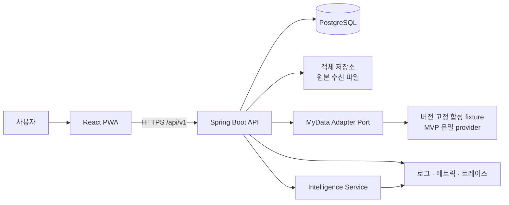

# FinMate vNext 시스템 아키텍처

> 상태: Review
> 적용 범위: FinMate vNext MVP
> 기준 계약: `../06-api/openapi.yaml`

## 1. 설계 목표

FinMate vNext는 `추천 모험가 → 루틴 선택 → 목표 확정 → 자동 레이드 → 퀘스트 → 기록` 흐름을 한 번의 사용자 세션과 이후의 비동기 마이데이터 갱신에서 일관되게 제공한다. 금융 수치와 상태 전이는 결정론적 코드가 소유하고, AI는 서버가 허용한 목표 후보 ID 안에서 추천 후보를 순위 1위로 고르고 근거를 설명하는 역할만 맡는다.

핵심 원칙은 다음과 같다.

- 프론트엔드는 OpenAPI로 생성한 타입과 명시적 도메인 응답만 사용한다.
- 한 사용자의 활성 목표는 최대 하나이며, 목표 확정과 상태 전이는 원자적으로 처리한다.
- 마이데이터 원본, 정규화 데이터, 계산 스냅샷, 공개용 카드 투영을 분리한다.
- 오래되거나 부족한 데이터는 숨기지 않고 모든 데이터 파생 응답의 `dataFreshness`와 일치하는 `X-Data-State`로 전달한다.
- 추천은 `INDIVIDUAL | GROUP_ROUTINE` 합타입이다. 어떤 집계도 30명 미만으로 만들지 않고 그룹 카드에 개인 이름·avatar를 포함하지 않는다.
- MVP 수집은 버전 고정 합성 fixture를 읽는 `SYNTHETIC` adapter만 사용한다. 실제 제공자 자격증명과 실제 고객 금융정보는 MVP 경계 밖이다.
- KRW와 basis point 입력·저장은 int64 정수, 중간 산술은 `arbitrary-precision`, 저장은 `checked int64`다. binary floating point는 사용하지 않는다.
- AI 장애가 목표 계산, 확정, 진행률 갱신을 막지 않는다.

## 2. 시스템 컨텍스트

브라우저가 호출하는 공개 진입점은 Spring Boot API 하나다. 프론트엔드는 MyData Adapter나 Intelligence Service를 직접 호출하지 않는다. 외부 제공자 및 AI 장애를 API가 안정적인 도메인 상태와 오류 계약으로 변환한다.

## 3. 런타임 경계

| 경계 | 책임 | 입력/출력 | 소유하지 않는 것 |
| --- | --- | --- | --- |
| Frontend | 화면 상태, 접근성, 낙관적 UI, 토큰 갱신, fixture 기반 개발 | `/api/v1` JSON | 금융 계산, 상태 판정, 개인정보 필터링 |
| API/Application | 인증·인가, 유스케이스 조정, 멱등성, 동시성, 트랜잭션 | OpenAPI 요청/응답 | 제공자별 원본 파싱, 자유 형식 AI 판단 |
| Domain | 목표 후보, 진행률, 레이드 단계, 퀘스트 검증, 공개 정책 | 타입이 있는 명령·결과 | HTTP, DB 프레임워크, LLM 호출 |
| MyData Adapter | 합성 payload를 실제 port와 같은 계좌·거래·잔액 입력으로 읽고 canonical row·중복 winner·sync lineage 생성 | synthetic payload → canonical source | 목표/레이드 계산, 사용자 문구 |
| Intelligence | 서버 허용 목표 후보 ID의 추천 순위·설명 생성 | 구조화 입력/출력 | 카드 자격·후보 생성, 후보 ID·수치·기간 생성·수정, 원본 타인 데이터 조회, 상태 전이 |
| Persistence | 원본 계보, 정규화 원장, 버전 고정 스냅샷, 감사 이력 | repository port | 화면 조합, AI 프롬프트 |
| Observability | 요청·잡·AI 호출의 상관관계, SLI, 보안 감사 | 구조화 로그·메트릭·트레이스 | 원문 금융 데이터와 인증 비밀 저장 |

## 4. 백엔드 모듈

MVP는 하나의 Spring Boot 배포 단위인 모듈러 모놀리스로 시작한다. 모듈 간 호출은 공개 application port를 통하며 다른 모듈의 테이블을 직접 조회하지 않는다.

| 모듈 | 주요 aggregate/책임 | 동기 의존 |
| --- | --- | --- |
| `identity` | User, Credential, RefreshSession | 없음 |
| `onboarding` | OnboardingProfile, Consent | identity |
| `mydata` | Connection, SyncJob, CanonicalTransaction, SyncState, DataFreshness | identity, onboarding |
| `adventurer` | `INDIVIDUAL | GROUP_ROUTINE` RecommendationCard와 안전 코호트 projection | mydata, onboarding |
| `goal` | GoalTemplate, 신규·교체 CandidateSet, UserGoal, ProgressSnapshot, 원자적 replacement | mydata, adventurer |
| `quest` | Quest, VerificationEvent, QuestXp | goal, mydata |
| `raid` | 목표 진행률에서 파생한 RaidState read model | goal |
| `reporting` | AnimalReport, JourneyDay, DailyRecord read model | mydata, goal, quest |
| `ai` | 허용 후보 순위·설명 요청, 구조·근거·수치 검증, fallback, 감사 로그 | adventurer, goal |
| `platform` | API 오류, 멱등성, outbox, 관측성, 시간/ID port | 없음 |

`raid`는 독립적인 전투 시뮬레이터가 아니다. 보스 HP와 단계는 저장된 목표 진행률 스냅샷에서 재현 가능한 투영이다. 시간 경과나 화면 재생 횟수는 진행률을 바꾸지 않는다.

## 5. 데이터 저장과 계보

PostgreSQL을 시스템 오브 레코드로 사용한다. 스키마는 모듈별 namespace 또는 명확한 접두사로 소유권을 표현한다.

1. `mydata_ingestion`: sync run/scope, 응답 ID·record ordinal, provider 기준·생성·수정 시각, checksum, 원본 객체 위치를 저장한다.
2. `mydata_ledger`: `userId`, `currency = KRW`, provider ID hash, `sourceDataVersion`, `canonicalizationVersion`, `sourceSyncRunId`와 내부이체·환불·중복 winner를 저장한다. 계산 신선도는 개별 transaction에 저장하지 않는다.
3. `financial_snapshot`: 계산 기간, 입력 event 버전, 계산 버전, 데이터 신뢰 상태를 고정한다.
4. `adventurer_projection`: 공개 허용 필드만 비식별 투영으로 저장한다. 원본 사용자 키는 API 직렬화 모델에 존재하지 않는다.
5. `goal_*`: 후보 만료, 확정 당시 기준선·템플릿·동의·계산 버전, 모든 진행률 변경을 저장한다.
6. `quest_*`, `record_*`: 검증 이벤트와 사용자 작성 회고를 금융 원장과 분리한다.
7. `outbox_event`: 같은 DB 트랜잭션에서 후속 투영·AI 설명·관측 이벤트를 발행한다.

객체 저장소에는 제공자 원본 수신 파일만 암호화해 보관한다. 공개 카드, 목표 계산, 프론트 응답은 객체 저장소 원본을 직접 읽지 않는다.

## 6. 주요 데이터 흐름

### 6.1 온보딩과 최초 기준선

1. 사용자가 가입하고 액세스 토큰을 받는다.
2. 생활 맥락, 위험 성향, 개인정보·마이데이터 동의 버전을 제출한다.
3. API가 `SYNTHETIC` 연결을 만들고 응답 body의 `initialSyncJob`으로 최초 sync를 명시한다.
4. Adapter가 수신 데이터를 canonical event로 변환하고 중복·내부이체·확인 필요 항목을 표시한다.
5. 계산기가 금융 스냅샷과 네 동물 스탯을 생성한다.
6. 최소 데이터가 충족되면 `FRESH`, 아니면 `INSUFFICIENT` 상태로 홈을 제공한다.

### 6.2 추천에서 목표 확정까지

1. `adventurer` 모듈이 공개 동의, 최소 표본, 최신성, 이상치 정책을 통과한 카드를 조회한다. 정확 코호트가 30명 미만이면 금융 수용력 제약을 고정한 채 비금융 생활맥락 태그만 결정적 순서로 넓힌다.
2. 안전한 상위 코호트가 30명 이상이면 개인 필드 없는 `GROUP_ROUTINE`을 반환하고, 끝까지 30명 미만이면 빈 카드와 `INSUFFICIENT`를 반환한다.
3. 사용자가 개인 루틴 또는 그룹 루틴 band를 선택한다.
4. `goal` 모듈이 기준선과 버전 고정 템플릿으로 최대 세 후보를 계산한다. 데이터가 부족하면 행동형 후보만 반환한다.
5. AI는 서버가 허용한 후보 ID와 계산 근거만 받아 `recommendedCandidateId`, `reasonCodes`, `summary`, `riskNotice`를 만든다. API/Application이 허용 ID·근거·수치·안전 정책을 검증하고 하나라도 실패하면 전체 출력을 폐기한다.
6. `GoalCandidateSet` 응답은 AI 성공과 폴백 모두 required `recommendation` 객체를 제공한다. 필드는 `recommendedCandidateId`, `reasonCodes`, `summary`, `riskNotice`, `recommendationState`이며 state는 서버가 `AI_GENERATED | DETERMINISTIC_FALLBACK` 중 하나로 설정한다. 후보 객체와 숫자는 recommendation 적용 전후 동일하다.
7. AI가 없거나 timeout·파싱·검증에 실패하면 코드가 `STANDARD → LIGHT → CHALLENGE → candidateId 오름차순`으로 순위를 정하고 승인된 근거·요약·위험 안내를 채운다.
8. 사용자가 후보·검증 방식·동의 버전을 확인한다.
9. 목표 생성은 멱등성 키와 DB unique constraint로 중복 확정을 차단하며 Goal, 최초 ProgressSnapshot, 연결 Quest, outbox event를 한 트랜잭션에 저장한다.

### 6.3 목표 일시정지와 재설정

1. 사용자 일시정지, 기준선 변화 `>= 2000 bp`, 장기 pause가 감지되면 기존 `UserGoal`은 `PAUSED`다. 연결 퀘스트도 같은 트랜잭션에서 `PAUSED`가 되어 완료·XP 지급을 차단한다.
2. 재설정 endpoint는 `replacesGoalId`가 있는 별도 후보 세트만 만든다. 기존 목표를 후보 상태로 바꾸지 않는다.
3. 교체 확인은 기존 목표 `CANCELLED / RECALIBRATED`, 새 목표 `ACTIVE`, 기존 퀘스트 종결, 새 퀘스트 생성을 한 트랜잭션으로 커밋한다.
4. 유효한 일반 재개는 만료되지 않은 연결 퀘스트를 저장한 이전 상태로 돌린다. 목표가 종결되면 미완료 연결 퀘스트를 취소·만료하며 일반 학습 퀘스트는 건드리지 않는다.

### 6.4 비동기 데이터 반영

1. `SUCCEEDED` 동기화 완료 이벤트가 계산 job을 시작한다. `PARTIAL_FAILED`는 성공 범위를 저장할 수 있지만 목표 계산을 완전 성공처럼 진행하지 않는다.
2. 새 canonical event와 사용자 수정 분류를 반영해 스냅샷을 계산한다.
3. 목표가 `ACTIVE`이고 데이터가 사용 가능할 때만 현재 진행률을 갱신한다.
4. 최고 진행률과 이미 해금한 단계는 감소시키지 않는다.
5. Quest 검증, Raid 투영, AnimalReport, Journey read model을 같은 입력 버전으로 갱신한다.
6. 완전 성공에서만 public `lastSyncedAt`을 전진시킨다. 부분 커밋은 `lastPartialSyncedAt`만 전진하고 이전 완전 성공 시각을 유지한다.
7. 클라이언트는 재접속 또는 명시적 조회로 최신 상태를 받는다. MVP 공개 API는 WebSocket에 의존하지 않는다.

## 7. 일관성과 동시성

- 사용자별 열린 목표 unique constraint로 `CONFIRMED | ACTIVE | PAUSED` 목표를 합쳐 하나만 허용한다.
- 목표 상태 변경은 `If-Match`와 aggregate version으로 낙관적 잠금을 적용한다.
- POST 명령은 `Idempotency-Key`의 사용자·경로·요청 해시와 결과를 24시간 보관한다.
- 모든 공개 동의 변경은 body `consentAggregateId`, `expectedVersion`, `anonymousCardOptIn`, `exposedFields`, `consentVersion`과 같은 version의 `If-Match`, `Idempotency-Key`를 요구한다. 같은 key·payload는 최초 응답을 재생하고 같은 key의 다른 payload는 `409`다.
- `anonymousCardOptIn = true`는 actual version이 `expectedVersion`/`If-Match`와 정확히 일치하고 aggregate가 non-terminal일 때만 적용한다. stale·delayed opt-in과 `WITHDRAWN` aggregate 대상 opt-in은 `412 PRECONDITION_FAILED`이며 새 aggregate를 암묵적으로 만들지 않는다.
- `anonymousCardOptIn = false` 철회는 같은 aggregate와 expected version의 opt-in/update보다 먼저 직렬화해 `WITHDRAWN`과 다음 version을 커밋한다. 경합에서 뒤로 밀린 opt-in은 `412`이고, 이미 철회된 요청의 같은 idempotency key 재시도는 최초 terminal 응답을 재생한다. 재동의는 새 ID다.
- DB 변경과 비동기 이벤트 발행은 transactional outbox를 사용한다.
- read model은 최종 일관성을 허용하되 `calculatedAt`, `sourceDataVersion`, `dataFreshness`를 함께 반환한다.
- 후보 확정 시 후보 만료, 활성 목표, 동의 버전, 데이터 최신성을 트랜잭션 안에서 다시 검사한다.
- 교체 후보 확인은 이전 목표 취소와 새 목표 활성화가 함께 성공하거나 함께 rollback된다.

## 8. 장애와 강등 전략

| 장애 | 사용자 계약 | 내부 처리 |
| --- | --- | --- |
| 마이데이터 제공자 지연 | 마지막 검증값과 `PENDING` 또는 `STALE`; 진행률 정지 | 지수 백오프, 제공자별 circuit breaker |
| 합성 범위 부분 실패 | 이전 `lastSyncedAt`, 새 `lastPartialSyncedAt`, 차단 작업 표시 | 성공 범위 commit, 실패 범위만 결정적 재시도 |
| 데이터 부족/분류 충돌 | 행동형 후보 또는 `NEEDS_REVIEW`; 영향 작업 목록 | 확인 큐와 재계산 event |
| AI timeout/스키마·근거·수치 위반 | 계산된 후보와 `recommendationState = DETERMINISTIC_FALLBACK` 순위·설명 정상 제공 | 1회 제한 재시도, 전체 출력 폐기, 결정론적 순위, 감사 로그 |
| read model 지연 | 이전 응답과 명시적 `calculatedAt` | outbox lag 경보, 재처리 가능 consumer |
| 중복 명령 | 최초 응답 재생 | idempotency record 조회 |
| 동시 상태 변경 | `412 PRECONDITION_FAILED` | 최신 ETag 재조회 유도 |

## 9. 보안과 개인정보 경계

- 외부 통신은 TLS 1.2 이상, 저장 데이터는 관리형 키로 암호화한다.
- 액세스 토큰은 15분, 회전형 `RefreshCookie`는 최대 30일로 제한한다. refresh는 cookie, logout은 bearer와 같은 cookie를 모두 요구한다.
- 로그에는 토큰, 쿠키, 거래 원문, 계좌·카드 식별자, 정확 타인 금액을 남기지 않는다.
- 공개 추천 투영은 allowlist 직렬화를 사용하고 원본 사용자 키와 별도 저장소를 사용한다.
- 지원·운영 조회는 역할 기반 권한과 사유 입력, 감사 로그를 요구한다.
- 수집·공개 동의 종결 상태는 `WITHDRAWN`이며 같은 동의 ID에서 되돌릴 수 없다. 재동의는 새 ID다.
- 사용자 공개 철회는 추천 조회에서 즉시 차단하고 캐시·파생 투영에서 24시간 이내 제거한다.
- AI 동의가 유효한 일반 `OPERATIONAL` 로그도 최대 90일이다. `INCIDENT_EVIDENCE`는 유효한 사고에 한해 최대 180일이며 철회·계정 삭제를 넘겨 존속할 수 없다.
- AI 동의 철회·계정 삭제 후 7일 안에 모든 non-`LEGAL_REQUIRED` 연결 레코드·콘텐츠를 삭제하거나 비가역 분리한다. 사건 전에 법적 근거·범위·만료·승인·case ID·승인 시각을 모두 갖춘 `LEGAL_REQUIRED` 재분류만 예외다.
- 백업은 최대 30일이며 서비스 개방 전에 철회·삭제 tombstone을 재생한다. 대상 레코드나 재연결 가능한 가명 매핑이 복원되면 복원을 실패 처리한다.

## 10. 배포와 환경

| 환경 | 목적 | 데이터 |
| --- | --- | --- |
| local | 프론트 fixture, API·adapter 개발 | 결정론적 합성 데이터 |
| test | 계약·통합·E2E 자동화 | 매 실행 격리된 합성 데이터 |
| staging | 운영과 같은 배포/관측/보안 검증 | 비식별 합성 데이터만 사용 |
| production MVP | 승인된 데모·내부 사용자 트래픽 | 버전 고정 합성 데이터와 synthetic adapter만 사용 |

실제 사업자 adapter, 운영 자격증명, 실제 고객 금융정보는 post-MVP 별도 승인·보안·법무 gate 뒤에만 추가한다. OpenAPI 동작과 오류 계약은 synthetic adapter 단계에서도 축약하지 않는다.

API와 worker는 같은 코드베이스에서 시작하되 서로 다른 process role로 실행할 수 있다. DB migration은 애플리케이션 배포 전에 실행하고, 하위 호환되는 expand/contract 순서를 따른다. Intelligence Service는 독립 배포하지만 API의 내부 timeout과 fallback 뒤에 둔다.

## 11. 구현 의존 규칙

- controller는 application command/query만 호출한다.
- domain은 Spring, JPA, HTTP, LLM SDK를 import하지 않는다.
- adapter는 domain port를 구현하며 다른 adapter를 직접 호출하지 않는다.
- API DTO와 persistence entity를 공유하지 않는다.
- 금융 수치의 모든 계산은 계산 버전과 입력 데이터 버전을 남긴다.
- OpenAPI의 모든 응답은 `X-Request-Id`, 모든 데이터 파생 성공 응답은 body `dataFreshness`와 같은 `X-Data-State`를 가진다.
- OpenAPI 변경은 생성 클라이언트, 모든 linked fixture schema 검증, operation별 429/500·request ID·freshness audit, 호환성 검사를 통과해야 병합한다.
