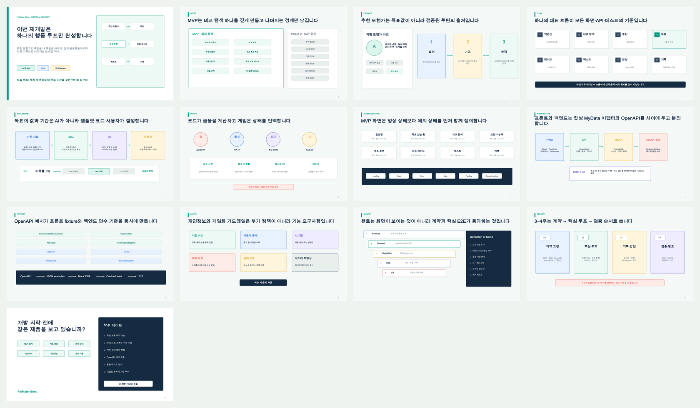
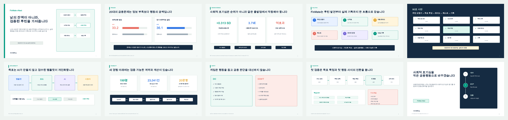

# FinMate vNext 공유 패키지

이 폴더에는 개발팀용 킥오프 자료와 외부 발표 초안이 함께 있다. 제품·API·계산의 기준은 상위 `docs/vnext/` 문서이며 PPT에서 새 정책을 결정하지 않는다.

## 산출물

| 파일 | 용도 |
| --- | --- |
| `notion-portal.md` | Notion 팀 홈에 붙여 넣는 문서 지도 |
| `kickoff-deck-outline.md` | 내부 킥오프 13장 구성 |
| `FinMate_vNext_Kickoff_Draft.pptx` | 내부 킥오프 편집본 |
| `FinMate_vNext_Kickoff_Draft.pdf` | 내부 킥오프 공유본 |
| `final-presentation-outline.md` | 7분 외부 발표 10장 구성 |
| `FinMate_vNext_Final_Pitch_Draft.pptx` | 외부 발표 편집본 |
| `FinMate_vNext_Final_Pitch_Draft.pdf` | 외부 발표 공유본 |
| `claim-evidence-matrix.md` | 수치 주장, 출처, 제한 |
| `demo-storyboard-90s.md` | 결정적 90초 시연 흐름 |

전체 문서·계약·발표자료의 실행 검증 결과는 상위 [VERIFICATION.md](../VERIFICATION.md)에서 확인한다.

## 미리보기





## 재생성

```bash
NODE_PATH=/Users/sungjh/.cache/codex-runtimes/codex-primary-runtime/dependencies/node/node_modules \
  /Users/sungjh/.cache/codex-runtimes/codex-primary-runtime/dependencies/node/bin/node \
  tools/presentation/build_vnext_decks.js

tools/presentation/export_vnext_decks.sh
```

한글 PDF 렌더링은 Microsoft PowerPoint를 사용한다. 현재 LibreOffice PDF 변환은 macOS 동적 한글 폰트의 글리프를 누락할 수 있어 검수용으로 사용하지 않는다.

## 검수 기준

- 킥오프 13장, 외부 발표 10장
- 각 PPTX에 슬라이드별 발표자 노트 포함
- PDF와 연락시트에서 한글 누락·잘림·겹침 없음
- 외부 발표의 모든 수치 주장에 근거 ID 포함
- 기존 `WALLY`, 4인 파티, FinRoom을 vNext 기준 기능처럼 표현하지 않음
- 두 PPTX와 PDF는 각각 5MB 미만
