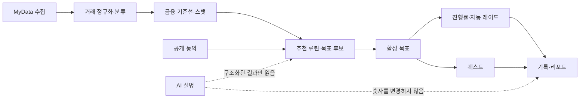

# FinMate vNext 도메인 모델

## 1. 문서 계약

이 문서는 FinMate vNext의 도메인 경계와 불변식을 정의한다. 구현체, API, 배치, 분석 모델은 아래 이름과 의미를 그대로 사용한다.

- 금액은 소수점이 없는 `KRW` 정수다. `154000`은 154,000원을 뜻한다.
- 비율은 `basis point` 정수다. `10000`은 100%, `1400`은 14%다.
- 모든 시각은 UTC 오프셋을 포함한 ISO 8601 문자열이다. 예: `2026-07-12T09:00:00+09:00`.
- 날짜는 ISO 8601 달력 날짜다. 예: `2026-07-12`.
- 기간은 ISO 8601 duration이다. 예: `P7D`, `P30D`.
- 계산 산출물에는 `calculationVersion`, `dataState`, `lastSyncedAt` field가 반드시 존재한다. `lastSyncedAt`은 마지막 완전 금융 sync이며 최초 sync 전·앱 이벤트 전용 결과만 명시적 null이다.
- 승인된 목표 템플릿만 목표 후보를 생성한다. AI는 템플릿, 금액, 비율, 기간, 진행률을 생성하거나 변경하지 않는다.

## 2. 공통 값 객체

| 값 객체 | 필드 | 규칙 |
| --- | --- | --- |
| `Money` | `amount`, `currency` | `amount`는 64비트 정수, `currency`는 항상 `KRW` |
| `BasisPoints` | `value` | 일반 비율은 `0..10000`; 원천 데이터의 음수 순유입은 별도 `KRW`로 보존 |
| `TimeRange` | `from`, `toExclusive` | ISO 8601 시각, 반개구간 `[from, toExclusive)` |
| `DataProvenance` | `dataState`, `lastSyncedAt`, `sourceDataVersion`, `calculationVersion` | 계산 결과 재현에 필요한 네 필드 |
| `MetricValue` | `unit`과 단위별 값 (`amountKrw`, `count`, `valueBps`, `days`, `xp`) | `unit` 판별 공용체다. `KRW`는 int64, `COUNT`/`DAYS`/`XP`는 0 이상 int64, `BASIS_POINT`는 `0..10000` 정수다. 한 객체에는 해당 단위의 값 필드만 존재한다. |
| `MetricRange` | `unit`과 단위별 최솟값·최댓값 | `KRW`, `COUNT`, `BASIS_POINT` 판별 공용체다. 양 끝은 같은 단위이고 최솟값은 최댓값 이하여야 한다. |
| `BaselineSnapshot` | `metricKey`, `metric: MetricValue`, `periodStart`, `periodEnd`, `excludedTransactionIds`, `userOverrideIds`, `provenance` | 목표 확정 이후 불변 |
| `TargetDefinition` | `kind`와 정확히 하나의 변형 (`value`, `range` + `requiredCount`, `requiredCount`) | `VALUE`, `RANGE`, `COUNT` 판별 공용체다. 다른 변형의 필드는 `null`이 아니라 생략하며 `requiredCount >= 1`이다. |

`dataState`는 다음 다섯 값만 허용한다.

| 값 | 한국어 표시 | 의미 |
| --- | --- | --- |
| `FRESH` | 최신 | 동의된 전송 주기와 유예 기간 안의 확정 데이터 |
| `PENDING` | 반영 대기 | 사용자의 새 행동은 기록됐으나 금융 원천 데이터가 아직 도착하지 않음 |
| `STALE` | 오래됨 | 전송 예정 시각과 유예 기간을 지났고 성공 데이터가 없음 |
| `INSUFFICIENT` | 부족 | 템플릿의 최소 계좌·완료월·검증 단위를 충족하지 못함 |
| `NEEDS_REVIEW` | 확인 필요 | 중복, 분류 충돌, 이상치 또는 사용자 확인 대기 거래가 계산 기간에 존재 |

우선순위는 `NEEDS_REVIEW > INSUFFICIENT > STALE > PENDING > FRESH`다. 여러 조건이 동시에 참이면 가장 왼쪽 값을 사용한다.

## 3. 바운디드 컨텍스트

| 컨텍스트 | 소유 객체 | 책임 | 금지 책임 |
| --- | --- | --- | --- |
| 연결·동의 | `MyDataConsent`, `ShareConsent` | 수집·공개 범위, 전송 주기, 철회 이력 | 목표 또는 진행률 계산 |
| 데이터 수집 | `SyncRun`, `RawAssetRecord` | 원천 수신, 암호화 저장, 체크포인트 | 거래 의미 추정 |
| 정규화 | `FinancialAccount`, `CanonicalTransaction`, `ClassificationDecision` | 공급자별 형식 통합, 중복 제거, 분류 | 목표 후보 선택 |
| 금융 진단 | `FinancialBaseline`, `AnimalStatSnapshot` | 소득·필수지출·여윳돈과 네 스탯 계산 | 게임 이벤트로 금융 스탯 가산 |
| 비교 탐색 | `RecommendationCard`, `IndividualAdventurerCard`, `GroupRoutineCard`, `VerifiedRoutine`, `ValidationGroup` | 공개 가능한 익명 루틴과 안전한 그룹 집계 | 원본 사용자 키·정확 금액 공개 |
| 목표 | `GoalTemplate`, `GoalCandidate`, `UserGoal` | 승인 규칙으로 후보 생성, 사용자 확정, 생명주기 | 자유형 AI 목표 생성 |
| 퀘스트 | `QuestTemplate`, `UserQuest`, `QuestEvidence` | 행동 시작과 검증, 퀘스트 XP | 보스 HP 직접 감소 |
| 레이드 | `RaidProgress` | 목표 진행률을 3단계 연출로 투영 | 시간 누적 피해·반복 시도 카운터 저장 |
| 기록·감사 | `GoalProgressSnapshot`, `JourneyRecord`, `AiAuditLog` | 계산 재현, 사용자 회고, AI 검증 | 과거 달성 이력 소급 변경 |

## 4. 핵심 애그리거트

### 4.1 사용자 금융 프로필

`FinancialProfile`은 사용자별 금융 계산의 루트다.

- `userId`
- `incomeRegularity`: `REGULAR | IRREGULAR`
- `contextTags`: 공개 동의와 별개인 내부 생활 맥락
- `riskProfileCheckedAt`: 투자 판단 점검 시각
- `activeMyDataConsentId`
- `currentBaselineId`
- `calculationVersion`
- `dataState`
- `lastSyncedAt`

불변식:

1. 유효한 수집 동의가 없으면 새 금융 원천을 수집하지 않는다.
2. `dataState != FRESH`인 정량 기준선은 새 정량 목표 확정에 사용할 수 없다.
3. 사용자 분류 수정은 원천 거래를 덮어쓰지 않고 `ClassificationDecision`으로 누적한다.

### 4.2 네 동물과 스탯

네 동물은 다른 사용자가 아니라 한 사용자의 네 금융 영역이다.

| 동물 | `animalCode` | 영역 | 스탯 | 허용 근거 |
| --- | --- | --- | --- | --- |
| 곰 | `BEAR` | 소비 | `SPENDING_DEFENSE` | 예산 범위 유지, 반복지출·거래 분류 점검 |
| 물개 | `SEAL` | 저축 | `SAVING_HP` | 저축성 순유입, 비상금 진행, 자동저축 유지 |
| 토끼 | `RABBIT` | 투자 판단 | `INVESTMENT_JUDGMENT` | 위험성향 확인, 쏠림 설명 확인, 분산 학습 |
| 새 | `BIRD` | 퀘스트·금융지식 | `QUEST_XP` | 승인된 퀴즈, 리포트, 기록, 회고 |

`AnimalStatSnapshot`은 `statValue`, `unit`, `period`, `evidenceIds`, `calculationVersion`, `dataState`, `lastSyncedAt`, `calculatedAt`을 저장한다. 곰·물개·토끼의 `statValue` 단위는 `BASIS_POINT`, 새는 누적 `XP` 정수다.

불변식:

1. 퀘스트 완료가 곰·물개·토끼 스탯을 직접 올리지 않는다.
2. 실제 금융 데이터가 목표 지표를 바꾼 경우에만 목표 진행률이 변한다.
3. 투자 금액, 수익률, 거래 횟수, 매수·매도는 토끼 스탯과 새 XP의 근거가 아니다.
4. 저축 계좌 만기 재예치는 물개 스탯과 목표에 새 저축으로 반영하지 않는다.

### 4.3 추천 모험가와 루틴

`RecommendationCard`는 `cardKind`로 구분하는 `INDIVIDUAL | GROUP_ROUTINE` 합타입이다. 두 변형은 같은 ID·목표 영역·신선도 계약을 공유하지만 개인정보 필드는 공유하지 않는다.

`IndividualAdventurerCard`는 공개에 별도 동의한 실제 사용자의 검증된 루틴을 비식별 형태로 투영한다.

- 공개: `cardId`, 일반화된 `contextTags`, `similarityReasons`, `routineSummaries`, `publicMetricBand`, `maintainedFor`, `dataAsOf`, `safetyStatus`
- 내부 전용: `sourceProfileKey`, `shareConsentId`, `validationGroupId`, 정확 원천 지표

카드 인덱스 진입 조건:

1. `ShareConsent.state == ACTIVE`
2. 검증 그룹 인원 `>= 30`
3. 출처 루틴 지표가 그룹 `P10..P90` 안에 있음
4. 희귀 태그, 상품·종목·직장·상세 지역이 제거됨
5. `safetyStatus == APPROVED`

정확 코호트가 `30`명 미만이면 개인 카드를 만들지 않는다. 이때 `cohortDefinitionVersion`의 결정적 일반화 순서로 비금융 생활맥락 태그만 넓히며 소득 규칙성, 여윳돈·부채부담 구간, 목표 안전범위 같은 금융 수용력 제약은 그대로 둔다. 처음 발견한 안전한 상위 코호트가 `30`명 이상이면 `GroupRoutineCard`를 만든다.

`GroupRoutineCard`는 `cardId`, `cardKind = GROUP_ROUTINE`, `goalDomain`, `generalizedContextTags`, `cohortSize`, `routineBands`, `validatedOn`, `dataFreshness`, `disclosureBadges`만 공개한다. `cohortSize >= 30`이어야 하며 개인 닉네임, 아바타, `sourceProfileKey`, 개인별 유지기간, 개인별 정확값은 존재하지 않는다. 허용된 모든 상위 코호트가 `30`명 미만이면 카드를 만들지 않고 `INSUFFICIENT / SAFE_COHORT_TOO_SMALL`을 반환한다.

추천 목표의 참고값은 출처 값을 그대로 복사하지 않는다. 개인 카드는 출처 값을 그룹 `P25..P75`로 제한한 뒤 목표 템플릿의 `safeBounds`로 다시 제한한다. 그룹 카드는 개인 출처값이 아니라 승인된 `routineBands`의 대표값만 같은 안전 제한에 넣는다.

### 4.4 목표

`GoalTemplate`은 버전 관리되는 승인 규칙이다. MVP 템플릿은 [goal-template-catalog.yaml](./goal-template-catalog.yaml)에만 정의한다.

`GoalCandidate`는 최대 24시간 유효한 계산 결과다. `CANDIDATE`는 금융 스탯, 레이드, 기록을 변경하지 않는다. 사용자가 수치·기간·검증 방식·동의 버전을 확인하면 `UserGoal`을 생성한다.

재설정 후보도 기존 목표와 분리된 `GoalCandidateSet`과 `GoalCandidate`다. `UserGoal.state`에는 `CANDIDATE`나 `RECALIBRATION_REQUIRED`가 없다. 기준선 변화 또는 장기 일시정지가 감지되면 기존 목표는 `state = PAUSED`, `recalibrationRequired = true`로 유지된다. 교체 후보 하나를 확인하는 트랜잭션에서만 기존 목표를 `CANCELLED`, `cancellationReason = RECALIBRATED`로 바꾸고 새 목표를 생성·활성화한다.

`UserGoal`의 필수 필드:

- 식별: `goalId`, `userId`, `candidateId`
- 고정 규칙: `goalTemplateId`, `templateVersion`, `calculationVersion`, `consentVersion`
- 고정 기준: `baselineSnapshot`, `targetDefinition`
- 상태: `state`, `confirmedAt`, `startedAt`, `endsAt`
- 진행: `currentProgressBps`, `highestProgressBps`
- 데이터: `dataState`, `lastSyncedAt`
- 재설정: `recalibrationRequired`, `recalibrationReason`, `replacementCandidateSetId`
- 종료: `cancellationReason`, `completedAt`, `expiredAt`, `cancelledAt`

불변식:

1. 사용자당 `ACTIVE` 목표는 최대 하나다.
2. 확정 후 템플릿 버전, 계산 버전, 기준선, 목표값은 자동 변경하지 않는다.
3. 소득 또는 필수지출이 기준선 대비 `2000 bps` 이상 변하면 진행 갱신을 멈추고 재설정을 요구한다.
4. `PAUSED` 동안 진행률·최고 진행률·레이드를 갱신하지 않는다.
5. 완료·만료·취소는 손실, 강등, XP 차감의 원인이 아니다.
6. 재설정 후보 생성은 기존 목표의 상태·목표값을 바꾸지 않는다. 교체 확인은 기존 목표 취소, 기존 미완료 퀘스트 terminal 전이, 새 목표 활성화, 새 퀘스트 생성을 같은 트랜잭션에서 수행하며 일부만 커밋할 수 없다. 기존·신규 퀘스트 ID 집합은 서로소이고, 새 목표·진행 스냅샷·퀘스트 종결/생성·트랜잭션 commit 시각은 교체 확인 시각 이상이어야 한다.

### 4.5 퀘스트

`UserQuest`는 목표를 돕거나 일반 금융학습을 제공하는 검증 가능한 행동이다. `goalId`가 있으면 목표 연결 퀘스트, 없으면 일반 학습 퀘스트다.

- `questId`, `questTemplateId`, `userId`, `goalId`
- `domain`, `difficulty`, `state`, `verificationSource`
- `requiredCount`, `verifiedCount`, `evidenceIds`
- `xpAwarded`, `startedAt`, `expiresAt`, `completedAt`
- `calculationVersion`, `dataState`, `lastSyncedAt`

앱 내부 퀴즈·리포트·기록은 이벤트 원장으로 즉시 검증한다. 입금·지출 기반 퀘스트는 금융 원천이 도착하기 전 `DATA_PENDING`이다. 투자 판단 퀘스트는 완료 기록만 남기고 `xpAwarded = 0`이다.

`QuestEvidence`는 검증에 실제 사용한 원천을 보존하는 append-only 값이다. 최소 필드는 `evidenceId`, `questId`, `evidenceType`, canonical `verificationSource`, `verificationStatus`, `sourceReferenceHash`, `occurredAt`, `verifiedAt`이다. `verificationSource`는 템플릿의 허용 목록과 같은 `VerificationSource` enum 값이어야 하며, raw provider ID나 앱 event ID는 저장·응답하지 않고 안정적인 SHA-256 참조만 노출한다.

목표 연결 퀘스트는 목표가 일시정지되는 같은 트랜잭션에서 `PAUSED`가 되며 `pausedFromState`를 저장한다. `PAUSED`에서는 증거 접수·완료·XP 이벤트 발행이 모두 금지된다. 목표가 여전히 유효하게 재개되면 만료 전 퀘스트만 `pausedFromState`로 복귀하고, 이미 만료된 퀘스트는 `EXPIRED`가 된다. 목표가 `EXPIRED`면 미완료 연결 퀘스트도 `EXPIRED`, 목표가 `COMPLETED | CANCELLED`면 미완료 연결 퀘스트는 `CANCELLED`가 된다. `goalId = null`인 일반 학습 퀘스트는 이 전파의 영향을 받지 않는다.

### 4.6 자동 레이드

`RaidProgress`는 `UserGoal`의 읽기 모델이다.

- `goalId`, `raidState`, `raidStage`
- `currentProgressBps`, `highestProgressBps`
- `stageProgressBps`, `bossHpBps`
- `unlockedStage`, `animationReduced`
- `calculationVersion`, `dataState`, `lastSyncedAt`, `updatedAt`

불변식:

1. `bossHpBps = 10000 - stageProgressBps`다.
2. `highestProgressBps`와 `unlockedStage`는 감소하지 않는다.
3. 현재 진행률 하락을 보스 회복, 실패, 벌점으로 표현하지 않는다.
4. 반복 시도 카운터, 오프라인 전투 횟수, 시간 누적 피해는 저장하지 않는다.
5. 투자 판단 목표에는 단계 진행과 설명만 제공하며 외형 성장·보상·축하 효과를 제공하지 않는다.
6. 완료 목표의 `GOAL_COMPLETED` projection은 리포트 조회로 바뀌지 않는다. 새 목표 활성화 또는 별도로 정의된 archival event만 현재 raid projection을 교체할 수 있다.

### 4.7 기록과 동기화

`GoalProgressSnapshot`은 진행률이 바뀌거나 상태 판정 근거가 바뀔 때 append-only로 저장한다. 최소 필드는 `snapshotId`, `goalId`, `calculatedAt`, `sourceDataVersion`, `period`, `metricValue`, `currentProgressBps`, `highestProgressBps`, `raidStage`, `raidState`, `changeReason`, `excludedTransactionIds`, `userOverrideIds`, `calculationVersion`, `dataState`, `lastSyncedAt`이다.

`SyncRun`은 공급자 호출 한 번의 기술 상태를 기록하고, `dataState`는 사용자 계산 가능성을 나타낸다. 두 상태는 서로 대체하지 않는다. 각 `SyncRun`은 `SUCCEEDED | PARTIAL_FAILED | FAILED | BLOCKED` 중 하나에서 종결되고 재시도는 새 `SyncRun`을 만든다. `IDLE`은 scheduler/connection readiness projection일 뿐 `SyncRun`에 저장하지 않는다. 동기화 성공 후에도 완료월 부족이면 `dataState = INSUFFICIENT`일 수 있다.

## 5. 도메인 이벤트

| 이벤트 | 발생 조건 | 소비자 |
| --- | --- | --- |
| `mydata.sync.succeeded` | 원천 수신과 정규화 커밋 완료 | 기준선·스탯 재계산 |
| `transaction.review.requested` | 중복·분류 충돌·이상치 발견 | 사용자 확인함, `dataState` 판정 |
| `baseline.calculated` | 계산 가능한 새 데이터 버전 생성 | 목표 후보 엔진, 리포트 |
| `goal.candidate.created` | 승인 템플릿으로 후보 생성 | 비교 탐색 UI |
| `goal.confirmed` | 후보·동의·멱등성 검증 성공 | 활성 목표, 레이드, 퀘스트 |
| `goal.progress.changed` | 실제 검증 지표 또는 상태 근거 변경 | 스냅샷, 레이드, 기록 |
| `goal.recalibration.required` | 기준선 20% 변화 또는 30일 초과 일시정지; 목표를 `PAUSED`로 유지 | 목표 재확인 UI, 연결 퀘스트 일시정지 |
| `goal.replacement.candidates.created` | 기존 목표용 별도 교체 후보 생성 | 목표 재확인 UI |
| `goal.replaced` | 교체 후보 확인 트랜잭션에서 기존 목표를 `RECALIBRATED` 사유로 취소하고 새 목표 활성화 | 레이드 재투영, 퀘스트 교체 |
| `quest.evidence.verified` | 승인 검증 출처가 증거 확정 | 퀘스트 상태, 허용 시 새 XP |
| `share.consent.withdrawn` | 공개 동의 철회로 상태가 `WITHDRAWN` | 추천 인덱스·파생 캐시 삭제 |

모든 이벤트는 `eventId`, `occurredAt`, `aggregateId`, `aggregateVersion`, `calculationVersion`을 포함한다. 금융 데이터에서 파생된 이벤트는 `dataState`, `lastSyncedAt`, `sourceDataVersion`도 포함한다.

## 6. 교차 컨텍스트 불변식

1. **한 번만 반영:** 자동저축 설정 확인은 퀘스트 증거가 될 수 있지만 실제 입금이 확인되기 전 물개 스탯과 목표 진행률을 바꾸지 않는다.
2. **숫자 소유권:** 금액·비율·기간·진행률·단계 판정은 결정적 코드만 소유한다. AI 출력은 승인 ID와 원래 숫자가 일치할 때만 설명으로 노출한다.
3. **데이터 투명성:** 홈·추천·후보·목표·리포트·퀘스트·연결·동기화·기록에는 `dataFreshness`와 그 안의 `dataState`, `lastSyncedAt`를 표시한다.
4. **버전 재현:** 목표 이력의 각 숫자는 저장된 기준선, 원천 데이터 버전, 제외 거래, 사용자 수정, `calculationVersion`으로 재현 가능해야 한다.
5. **철회 분리:** 공개 철회는 타인의 추천 인덱스에서 원본 연결을 제거하지만 철회자의 개인 기록과 이미 확정된 타인의 비식별 목표 이력은 소급 삭제하지 않는다.
6. **게임화 안전:** 현금, 포인트, 쿠폰, 금융상품 혜택을 지급하지 않으며 투자 행동에는 XP·배지·축하 효과를 지급하지 않는다.
